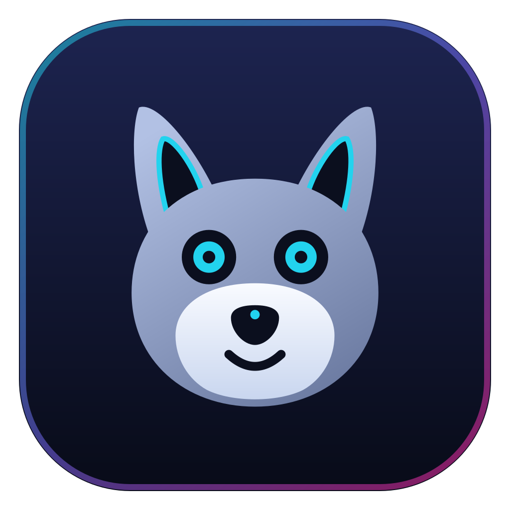
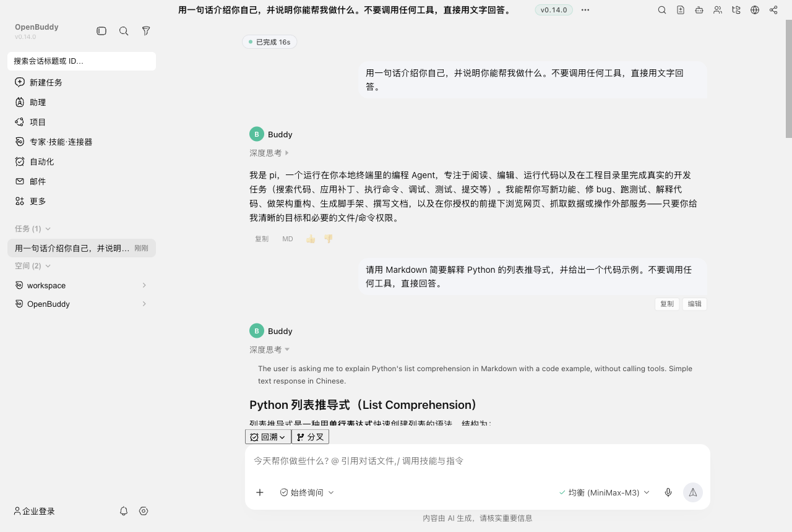
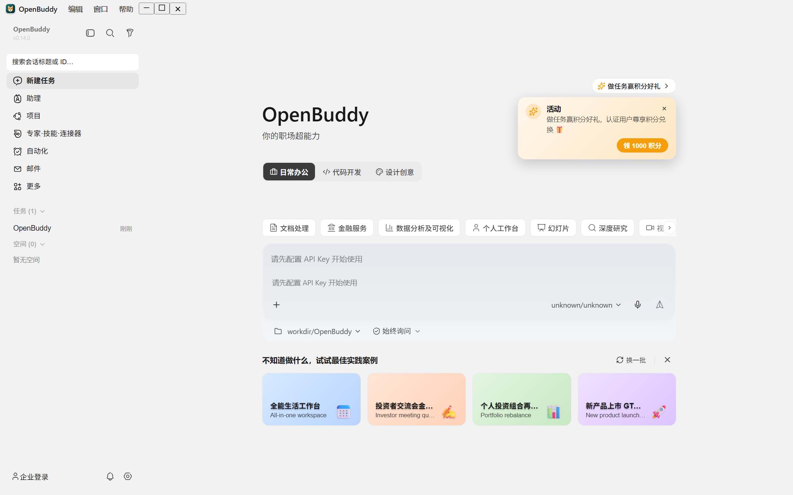
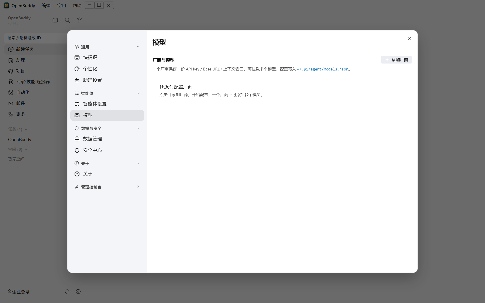
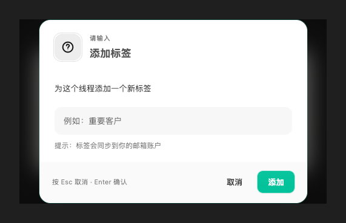
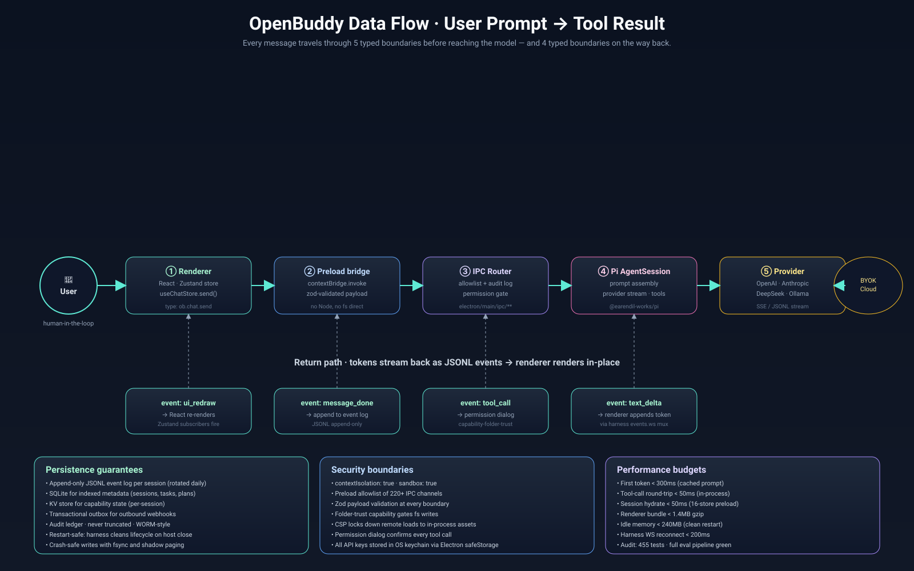
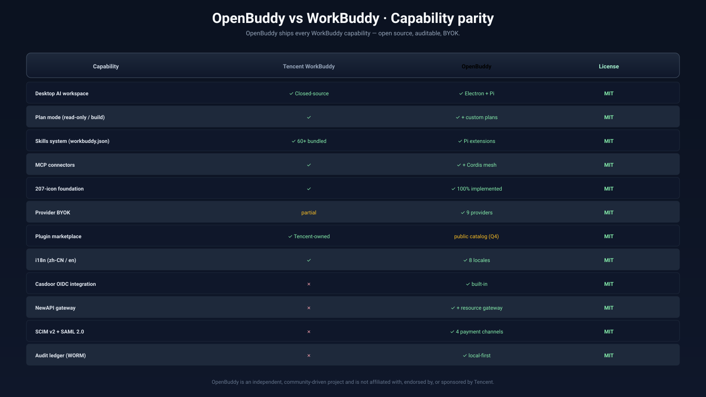

<div align="center">



# OpenBuddy

### The open desktop AI workspace that you can actually read, fork, and own.

**English** · [简体中文](README.zh-CN.md)

<a href="docs/README.md"></a>
<a href="CONTRIBUTING.md"></a>
<a href="docs/COMMUNITY.md"></a>
<a href="SPONSORS.md"></a>

<br/>

<a href="https://github.com/louloulin/OpenBuddy/stargazers"></a>
<a href="https://github.com/louloulin/OpenBuddy/releases"></a>
<a href="https://github.com/louloulin/OpenBuddy/actions"></a>
<a href="https://github.com/louloulin/OpenBuddy/blob/main/LICENSE"></a>

<br/>


<br/><br/>

**OpenBuddy is a WorkBuddy-style desktop AI workspace, rebuilt as 100% open source (MIT) on Electron + Pi.**
It ships the polished UI, plan mode, skills, MCP connectors, and an enterprise-grade Casdoor × NewAPI integration — every byte auditable, every provider BYOK.

[Quick Start](#-quick-start) · [Features](#-features) · [Architecture](#-architecture) · [Documentation](#-documentation) · [Contributing](CONTRIBUTING.md) · [Community](docs/COMMUNITY.md)

</div>

---

## 📑 Table of Contents

- [Why OpenBuddy?](#-why-openbuddy)
- [✨ Features](#-features)
- [🎬 Demo & Screenshots](#-demo--screenshots)
- [⚔️ OpenBuddy vs WorkBuddy](#%EF%B8%8F-openbuddy-vs-workbuddy)
- [🚀 Quick Start](#-quick-start)
- [🏗️ Architecture](#-architecture)
- [🧩 Capabilities](#-capabilities)
- [🛠️ Built With](#-built-with)
- [📚 Documentation](#-documentation)
- [🗺️ Roadmap](#-roadmap)
- [🤝 Contributing](#-contributing)
- [🛡️ Security](#-security)
- [🌍 Community](#-community)
- [⭐ Star History](#-star-history)
- [🙏 Acknowledgements](#-acknowledgements)
- [📄 License](#-license)

---

## 💡 Why OpenBuddy?

[**Tencent WorkBuddy**](https://workbuddy.tencent.com/) showed the world what a great desktop AI agent workspace should feel like — polished UI, plan mode, skills, MCP connectors. It's a genuinely capable product.

**But it's closed-source, and your data flows through Tencent's backend.**

**OpenBuddy is the open answer** — the same shape of experience, rebuilt from the ground up on Electron + Pi, with a Cordis capability mesh that any contributor can extend:

<table>
<tr><td>🔓</td><td><strong>100% open source (MIT)</strong><br/>No telemetry black box, no vendor lock-in. The whole repo is auditable.</td></tr>
<tr><td>⚡</td><td><strong>Electron + Pi runtime</strong><br/>One tested desktop host with a versioned preload bridge; the renderer only sees a typed API surface.</td></tr>
<tr><td>🔁</td><td><strong>Restart-safe sessions</strong><br/>Pi sessions, provider settings, capability state, and audit logs persist across renderer reloads and Electron restarts.</td></tr>
<tr><td>🤖</td><td><strong>Pi as the agent runtime</strong><br/>The in-process <code>AgentSession</code> owns prompts, tools, permissions, plans, tasks, and streaming events.</td></tr>
<tr><td>🌐</td><td><strong>Truly cross-platform</strong><br/>One codebase, Windows, macOS, and Linux. <a href="electron-builder.yml">electron-builder</a> produces signed installers for each.</td></tr>
<tr><td>🪐</td><td><strong>moon DAG monorepo</strong><br/>66 projects (1 root + 1 Electron + 64 workspace packages), type-check/test/build incrementally. CI runs the same <code>moon run</code> commands you run locally.</td></tr>
<tr><td>🧩</td><td><strong>Cordis capability mesh</strong><br/>59 workspace packages (5 capability, 8 collaboration, 26 UI, …) (<code>@openbuddy/*</code>) — skills, memory, plan, task, email, calendar, MCP, payment, SCIM, SAML… pick what you need.</td></tr>
<tr><td>🏢</td><td><strong>Enterprise-ready</strong><br/>Casdoor OIDC, NewAPI gateway, 4 payment channels, SCIM v2, SAML 2.0, transactional outbox webhooks, audit ledger — production-ready building blocks.</td></tr>
</table>

> *"If WorkBuddy is the polished product, OpenBuddy is the one you can actually read, fork, and own."*

<div align="center">

### 🌟 If this project matters to you, please give it a ⭐

It helps others discover OpenBuddy and keeps development moving.

<a href="https://github.com/louloulin/OpenBuddy/stargazers"></a>

</div>

---

## ✨ Features

<table>
<tr><th width="50%">Surface</th><th width="50%">Capabilities</th></tr>
<tr>
<td valign="top">

**🎨 Pixel-close WorkBuddy UI**
Ported `--wb-*` design tokens, full 207-icon foundation (all implemented, no stubs), brand atoms. It looks like WorkBuddy because the same atoms make it up.

**⚙️ Pi, in-process**
`@earendil-works/pi-coding-agent` runs in Electron Main. Renderer code only sees the typed preload API; no Node or provider SDK is required in the UI.

**🔌 Pi events as contract**
Streaming assistant deltas, tool calls, plan updates, permission requests, and completion events flow through cleanup-aware `pi://*` events.

</td>
<td valign="top">

**🔑 BYOK, multi-provider**
Bring your own keys. Configure Anthropic, OpenAI-compatible, Pi, MiniMax, NewAPI, or custom providers in the local Pi/OpenBuddy data directory.

**🧩 Extensible agent surface**
- **Skills** — Pi skills and local skill catalogs
- **MCP connectors** — local connector roots + OAuth/auth status
- **Experts / Assistants** — local Pi/OpenBuddy agent files
- **Plugins** — loadable via the marketplace

**🚀 Advanced workflows**
Plan mode (toggle & view) · Rewind (rewind & fork) · sub-agent Tasks (observe & cancel) · Slash Commands · local Automations scheduler.

**📦 Cross-platform installers**
Windows (NSIS `.exe` + MSI), macOS (`.dmg`), Linux (AppImage + `.deb`). CI-built releases via GitHub Actions.

</td>
</tr>
<tr>
<td valign="top">

**🏢 Enterprise integration**
- **Casdoor** — OIDC SSO + tenant policy + audit log
- **NewAPI** — model aggregation gateway (BYOK + Service Token)
- **Stripe / WeChat Pay / Alipay** — 4 payment adapters
- **SCIM v2** — RFC 7644 user/group provisioning
- **SAML 2.0** — AuthnRequest/Response/LogoutRequest
- **Transactional outbox** — webhook delivery with exponential backoff

</td>
<td valign="top">

**🧪 Battle-tested quality**
- **309 test files** across the monorepo (Vitest)
- **Live integration tests** against public Casdoor + NewAPI endpoints
- **Closed-loop capability evals** for end-to-end agent runs
- **Type-safe IPC** — every preload channel is allowlisted in `electron/preload/index.ts`
- **Storage boundaries** — automated architecture enforcement

**🌍 Internationalization**
Full UI locale coverage via `@openbuddy/ui-locale`; ships English + 简体中文 out of the box.

**🪟 Native desktop polish**
System tray, native notifications, deep links (`casdoor://`), clipboard integration, multi-window, autosave-on-quit.

</td>
</tr>
</table>

---

## 🎬 Demo & Screenshots

> Captured from the live dev renderer at `http://127.0.0.1:1420/` against commit `a9d240ff`. To regenerate, run `pnpm electron:dev` and use the Playwright recipe in `scripts/electron/screenshot.mjs`.

### AI chat with a real model — MiniMax-M3 over Anthropic Messages

<p align="center">
  
</p>

> Two-turn conversation against the real `MiniMax-M3` model via
> `https://api.minimaxi.com/anthropic`. Captured end-to-end by
> `scripts/electron/capture-chat-screenshot.mjs`: register provider → save
> model with `reasoning:true` → set thinking level `high` → type into the
> composer → wait for the renderer to settle. Both turns exercise the
> collapsible **深度思考** channel and the markdown/code render path.

### Main desktop shell (中文 / 简体中文 default)

<p align="center">
  
</p>

### Settings panel (简体中文)

<p align="center">
  
</p>

### Permission dialog (zh-CN)

<p align="center">
  
</p>

### 30-second tour — what you get

<p align="center">
  
</p>

### Architecture overview

<p align="center">
  
</p>

### Capability matrix

<p align="center">
  
</p>

### Data flow — prompt to tool result

<p align="center">
  
</p>

### WorkBuddy parity

<p align="center">
  
</p>

### Bilingual support

OpenBuddy ships with first-class bilingual UI: **`zh-CN` (default)** and **`en-US`**. Translations live as JSON dictionaries under `packages/ui/openbuddy-ui-locale/src/dictionaries/`. The locale persists in `localStorage` under `openbuddy:locale` and is hot-swappable at runtime via the `LocaleService` API — no renderer reload required for the active dictionary after the next navigation. See [`docs/I18N.md`](docs/I18N.md) for the full workflow and how to add a third locale.

All primary documentation is shipped as **separate files per language** so contributors can edit them in parallel without merge churn:

| Document | English | 简体中文 |
|---|---|---|
| Landing README | [`README.md`](README.md) | [`README.zh-CN.md`](README.zh-CN.md) |
| Codebase analysis | [`docs/CODEBASE_ANALYSIS.md`](docs/CODEBASE_ANALYSIS.md) | [`docs/CODEBASE_ANALYSIS.zh-CN.md`](docs/CODEBASE_ANALYSIS.zh-CN.md) |
| Docs index | [`docs/README.md`](docs/README.md) | [`docs/README.zh-CN.md`](docs/README.zh-CN.md) |
| Getting started | [`docs/GETTING_STARTED.md`](docs/GETTING_STARTED.md) | [`docs/GETTING_STARTED.zh-CN.md`](docs/GETTING_STARTED.zh-CN.md) |
| Architecture | [`docs/ARCHITECTURE.md`](docs/ARCHITECTURE.md) | [`docs/ARCHITECTURE.zh-CN.md`](docs/ARCHITECTURE.zh-CN.md) |
| FAQ | [`docs/FAQ.md`](docs/FAQ.md) | [`docs/FAQ.zh-CN.md`](docs/FAQ.zh-CN.md) |
| Performance | [`docs/PERFORMANCE.md`](docs/PERFORMANCE.md) | [`docs/PERFORMANCE.zh-CN.md`](docs/PERFORMANCE.zh-CN.md) |
| Contributing | [`CONTRIBUTING.md`](CONTRIBUTING.md) | [`CONTRIBUTING.zh-CN.md`](CONTRIBUTING.zh-CN.md) |
| Governance | [`GOVERNANCE.md`](GOVERNANCE.md) | [`GOVERNANCE.zh-CN.md`](GOVERNANCE.zh-CN.md) |
| Code of Conduct | [`CODE_OF_CONDUCT.md`](CODE_OF_CONDUCT.md) | [`CODE_OF_CONDUCT.zh-CN.md`](CODE_OF_CONDUCT.zh-CN.md) |
| Security | [`SECURITY.md`](SECURITY.md) | [`SECURITY.zh-CN.md`](SECURITY.zh-CN.md) |
| Support | [`SUPPORT.md`](SUPPORT.md) | [`SUPPORT.zh-CN.md`](SUPPORT.zh-CN.md) |
| Maintainers | [`MAINTAINERS.md`](MAINTAINERS.md) | [`MAINTAINERS.zh-CN.md`](MAINTAINERS.zh-CN.md) |
| Sponsors | [`SPONSORS.md`](SPONSORS.md) | [`SPONSORS.zh-CN.md`](SPONSORS.zh-CN.md) |
| Brand | [`BRAND.md`](BRAND.md) | [`BRAND.zh-CN.md`](BRAND.zh-CN.md) |
| Changelog | [`CHANGELOG.md`](CHANGELOG.md) | [`CHANGELOG.zh-CN.md`](CHANGELOG.zh-CN.md) |
| Roadmap / TODO | [`TODO.md`](TODO.md) | [`TODO.zh-CN.md`](TODO.zh-CN.md) |

See [`docs/diagrams/`](docs/diagrams/) for the full set of system architecture diagrams in SVG / HTML format.

---

## ⚔️ OpenBuddy vs WorkBuddy

Only rows we can publicly substantiate — see [`docs/workbuddy-parity-matrix.md`](docs/workbuddy-parity-matrix.md) for the full matrix.

| Capability | WorkBuddy | OpenBuddy |
|---|---|---|
| License | Closed-source | **MIT (open)** |
| Data path | Tencent backend | **Local + your gateway** |
| Plan mode | ✅ | ✅ |
| Skills | ✅ | ✅ + open catalog |
| MCP connectors | ✅ | ✅ |
| Experts / Assistants | ✅ | ✅ (local files) |
| Rewind & fork | ✅ | ✅ |
| Sub-agent Tasks | ✅ | ✅ |
| Automations | ✅ | ✅ (local scheduler) |
| Slash commands | ✅ | ✅ |
| Local persistence | ✅ | ✅ (restart-safe) |
| Provider choice | Limited | **BYOK — Anthropic / OpenAI / NewAPI / custom** |
| Casdoor OIDC | ❌ | ✅ |
| NewAPI gateway | ❌ | ✅ (BYOK + Service Token) |
| SCIM v2 | ❌ | ✅ (RFC 7644) |
| SAML 2.0 | ❌ | ✅ |
| Plugin SDK | Closed | **Cordis open capability mesh** |
| Tests visible to users | ❌ | **309 test files in the repo** |
| Cross-platform | Win / macOS | **Win / macOS / Linux** |
| Audit log | Backend | **Local + Casdoor tenant ledger** |

---

## 🚀 Quick Start

### Prerequisites

- **Node.js 22+** (we use Node 22 features; see `package.json` `packageManager`)
- **pnpm 10+** — `npm install -g pnpm`
- **Git** with submodule support
- **(Optional)** Platform build tools — see [`docs/release-ci.md`](docs/release-ci.md)

### Install & Run (development)

```bash
# 1. Clone with submodules
git clone --recurse-submodules https://github.com/louloulin/OpenBuddy.git
cd OpenBuddy

# 2. Install deps (also runs `moon sync projects` automatically)
pnpm install

# 3. Start the dev shell — Electron host + Vite renderer + HMR
pnpm electron:dev
#   ↑ equivalent to:  moon run openbuddy:dev.electron
```

> The first run takes ~30s for the Vite cold start. Subsequent restarts are sub-second thanks to moon's incremental DAG.

### Build a production installer

```bash
# Windows installer (NSIS .exe + MSI)
pnpm electron:build:win

# macOS installer (DMG)
pnpm electron:build:mac

# Linux AppImage / .deb
pnpm electron:build:linux

# All three
pnpm electron:build:all
```

### Verify your environment

```bash
# Type-check the entire 32-project monorepo
pnpm workspace:typecheck

# Run the full Vitest suite (309 test files)
pnpm workspace:test

# Closed-loop capability evaluation (real agent run + scoring)
pnpm test:closed-loop
```

Need a deeper walkthrough? Head to **[`docs/GETTING_STARTED.md`](docs/GETTING_STARTED.md)**.

---

## 🏗️ Architecture

OpenBuddy is a **three-layer Electron app** with a **Cordis capability mesh** under the hood:

```
┌──────────────────────────────────────────────────────────────┐
│  React Renderer (src/, packages/ui/*)                        │
│    Vite + React 18 + Zustand stores                          │
│    Foundation: --wb-* tokens, 207-icon set, brand atoms      │
└──────────────────────┬───────────────────────────────────────┘
                       │ window.api (typed contextBridge)
┌──────────────────────┴───────────────────────────────────────┐
│  Electron Main + preload bridge                              │
│    ipc.ts                ← allowlisted IPC handlers          │
│    agent-host.ts         ← Pi AgentSession lifecycle         │
│    pi-event-bridge.ts    ← cleanup-aware pi://* events       │
│    pi-resources.ts       ← local persistence (Cordis fs)     │
│    capability-*.ts       ← Cordis capability services        │
└──────────────────────┬───────────────────────────────────────┘
                       │ typed Pi session events
┌──────────────────────┴───────────────────────────────────────┐
│  Pi AgentSession + Cordis capability services                │
│    providers, tools, permissions, plans, tasks, persistence  │
└──────────────────────────────────────────────────────────────┘
```

**Capability mesh** — every feature is a Cordis service under `packages/<group>/openbuddy-*/`:

```
runtime/      cordis · plugin-host · storage
renderer/     renderer-host (preload bridge glue)
bundle/       base (umbrella for renderer-only deps)
auth/         casdoor · permission
team/         team · subagent
capability/   memory · inspiration · web-search · plan ·
              folder-trust · task · automation · calendar · email · mcp-client · authorization
core/         session
fs/           fs-local
shared/       files-kb · types
collaboration/ coordinator · evidence · inbox · network · policy · protocol · room · task
payment/      Stripe / WeChat Pay / Alipay / HMAC adapters
saml/         SAML 2.0 primitives
scim/         SCIM v2 endpoints (RFC 7644)
webhook-outbox/ transactional outbox + retry/backoff
ui/           26 UI packages (shell, sidebar, settings, workbench, …)
```

### Project layout

```
src/                     # React frontend
  styles/                # tokens.css / global.css / app.css
  foundation/components/Icon/   # ported from WorkBuddy (207 icons, all implemented)
  lib/                   # pi-client.ts + electron-api.ts (typed bridge wrappers)
  stores/                # Zustand: session / sessions / permission / ...
  components/            # Topbar, Sidebar, HomePage, ChatView, Composer, ...

electron/                # Electron main + preload host
  main/                  # index.ts · window.ts · ipc.ts · agent-host.ts · sessions.ts
  preload/               # contextBridge surface (allowlisted)

apps/
  admin-portal/          # Independent React SPA (Casdoor OIDC + Resource Gateway)

packages/                # one moon project per capability (50+ packages)
  runtime/openbuddy-{cordis,plugin-host,storage}/
  renderer/openbuddy-renderer-host/
  bundle/openbuddy-base/
  auth/openbuddy-{casdoor,permission}/
  team/openbuddy-{team,subagent}/
  capability/openbuddy-{memory,inspiration,web-search,plan,
              folder-trust,task,automation,calendar,email,mcp-client,authorization}/
  core/openbuddy-session/
  fs/openbuddy-fs-local/
  shared/openbuddy-{files-kb,types}/
  collaboration/openbuddy-{coordinator,evidence,inbox,network,policy,
              protocol,room,task}/
  payment/               # Stripe / WeChat Pay / Alipay / HMAC
  saml/                  # SAML 2.0 primitives
  scim/                  # SCIM v2 endpoints
  webhook-outbox/        # transactional outbox
  ui/openbuddy-{shell,sidebar,settings,workbench,…} (19 packages)

.moon/                   # moon workspace + task configuration
  workspace.yml          # 32-project graph (renderer + Electron + packages)
  tasks/                 # typecheck / test / build / dev / electron.* presets
  toolchains.yml         # node 22 / pnpm 10 / typescript 5.6

moon.yml                 # renderer moon project (Vite + React)
electron/moon.yml        # Electron host moon project

scripts/                 # dev/build helpers (thin shims over moon tasks)
docs/                    # all documentation (this folder)
```

For a deeper dive see **[`docs/ARCHITECTURE.md`](docs/ARCHITECTURE.md)**.

---

## 🧩 Capabilities

OpenBuddy ships with **63 workspace packages (12 capability, 26 UI, 8 collaboration, …)**, every one a Cordis service that can be enabled, configured, or extended independently.

### Core agent

| Package | Purpose |
|---|---|
| `@openbuddy/core-session` | Session lifecycle, fork, rewind |
| `@openbuddy/capability-plan` | Plan mode + plan approval flow |
| `@openbuddy/capability-task` | Sub-agent task spawning & cancellation |
| `@openbuddy/capability-automation` | Local scheduler for recurring agent runs |
| `@openbuddy/capability-web-search` | Provider-pluggable web search |
| `@openbuddy/capability-inspiration` | Prompt templates & starters |
| `@openbuddy/capability-folder-trust` | Per-folder permission grants |
| `@openbuddy/capability-authorization` | Capability-level policy |
| `@openbuddy/capability-mcp-client` | MCP connector governance |

### File & shell

| Package | Purpose |
|---|---|
| `@openbuddy/fs-fs-local` | Local filesystem via Cordis |
| `@openbuddy/files-kb` | Knowledge-base file indexing |

### Multi-agent

| Package | Purpose |
|---|---|
| `@openbuddy/team-team` | Multi-agent team orchestration |
| `@openbuddy/team-subagent` | Sub-agent spawning |
| `@openbuddy/collaboration-protocol` | A2A message envelopes |
| `@openbuddy/collaboration-room` | Shared rooms |
| `@openbuddy/collaboration-inbox` | Cross-agent inbox |
| `@openbuddy/collaboration-policy` | Cross-agent policy |
| `@openbuddy/collaboration-task` | Cross-agent task graph |
| `@openbuddy/collaboration-network` | Network topology |
| `@openbuddy/collaboration-evidence` | Audit evidence |
| `@openbuddy/collaboration-coordinator` | Coordination layer |

### Enterprise

| Package | Purpose |
|---|---|
| `@openbuddy/auth-casdoor` | Casdoor OIDC client + admin REST |
| `@openbuddy/auth-permission` | Permission prompts & policy UI |
| `@openbuddy/payment` | Stripe / WeChat Pay / Alipay / HMAC |
| `@openbuddy/saml` | SAML 2.0 primitives |
| `@openbuddy/scim` | SCIM v2 endpoints (RFC 7644) |
| `@openbuddy/webhook-outbox` | Transactional outbox + retry/backoff |

### Email & calendar

| Package | Purpose |
|---|---|
| `@openbuddy/capability-email` | IMAP/SMTP + Gmail/Graph/JMAP API |
| `@openbuddy/capability-calendar` | Calendar integration |

### UI primitives

19 packages under `packages/ui/openbuddy-ui-*` — shell, sidebar, settings, settings-models, workbench, home, conversation, experts, dialogs, markdown, primitives, modules, theme, runtime, slots, automation, locale, hmr.

---

## 🛠️ Built With

<table>
<tr><th>Layer</th><th>Tech</th></tr>
<tr><td>Shell</td><td><a href="https://www.electronjs.org/">Electron 44</a>, <a href="https://www.electron.build/">electron-builder 26</a>, <a href="https://github.com/Squirrel/Squirrel.Windows">Squirrel</a>, <a href="https://github.com/Squirrel/Squirrel.Mac">Squirrel.Mac</a></td></tr>
<tr><td>Renderer</td><td><a href="https://react.dev/">React 18</a>, <a href="https://vitejs.dev/">Vite 5</a>, <a href="https://github.com/pmndrs/zustand">Zustand 4</a>, <a href="https://reactrouter.com/">React Router 6</a>, <a href="https://github.com/remarkjs/react-markdown">react-markdown</a>, <a href="https://github.com/lucide-icons/lucide">lucide-react</a>, <a href="https://katex.org/">KaTeX</a>, <a href="https://github.com/mermaid-js/mermaid">Mermaid</a></td></tr>
<tr><td>Agent runtime</td><td><a href="https://github.com/badlogic/pi-mono">@earendil-works/pi-coding-agent</a>, <a href="https://github.com/badlogic/pi-mono">@earendil-works/pi-agent-core</a>, <a href="https://github.com/badlogic/pi-mono">@earendil-works/pi-ai</a></td></tr>
<tr><td>Capability mesh</td><td><a href="https://github.com/cordisjs/cordis">Cordis 3</a>, <a href="https://modelcontextprotocol.io/">MCP SDK 1.25</a></td></tr>
<tr><td>Monorepo</td><td><a href="https://moonrepo.dev">moon 2.5</a>, <a href="https://pnpm.io/">pnpm 11</a></td></tr>
<tr><td>Quality</td><td><a href="https://vitest.dev/">Vitest 2</a>, <a href="https://playwright.dev/">Playwright 1.58</a>, <a href="https://testing-library.com/">Testing Library</a>, TypeScript 5.6 strict</td></tr>
<tr><td>Backend integrations</td><td>Casdoor, NewAPI, Stripe, WeChat Pay, Alipay, IMAP, SMTP, Gmail API, Graph API, JMAP</td></tr>
</table>

---

## 📚 Documentation

All documentation lives in [`docs/`](docs/). Start here:

| Doc | What it's for |
|---|---|
| **[`docs/README.md`](docs/README.md)** | Full docs index |
| **[`docs/GETTING_STARTED.md`](docs/GETTING_STARTED.md)** | 30-minute developer setup |
| **[`docs/ARCHITECTURE.md`](docs/ARCHITECTURE.md)** | Layer-by-layer architecture deep dive |
| **[`docs/CODEBASE_ANALYSIS.md`](docs/CODEBASE_ANALYSIS.md)** | Verified 2026-09-05 package inventory & build/runtime architecture |
| **[`docs/PLUGIN_DEVELOPMENT.md`](docs/PLUGIN_DEVELOPMENT.md)** | Build your first Cordis capability |
| **[`docs/FAQ.md`](docs/FAQ.md)** | Frequently asked questions |
| **[`docs/COMMUNITY.md`](docs/COMMUNITY.md)** | Where to ask, chat, and contribute |
| **[`docs/ROADMAP.md`](docs/ROADMAP.md)** | Public roadmap |
| **[`SECURITY.md`](SECURITY.md)** | Security policy & disclosures |
| **[`SUPPORT.md`](SUPPORT.md)** | How to get help |
| **[`docs/release-ci.md`](docs/release-ci.md)** | Release & CI pipeline |
| **[`docs/workbuddy-parity-matrix.md`](docs/workbuddy-parity-matrix.md)** | OpenBuddy vs WorkBuddy capability parity |
| **[`docs/openbuddy-capability-matrix.md`](docs/openbuddy-capability-matrix.md)** | Package-by-package capability list |
| **[`docs/TESTING.md`](docs/TESTING.md)** | Testing strategy & conventions |
| **[`docs/PERFORMANCE.md`](docs/PERFORMANCE.md)** | Performance budget & optimization |
| **[`docs/ACCESSIBILITY.md`](docs/ACCESSIBILITY.md)** | WCAG 2.2 AA conformance |
| **[`docs/OPERATIONS.md`](docs/OPERATIONS.md)** | Production deployment & ops |
| **[`docs/WORKBUDDY_MIGRATION.md`](docs/WORKBUDDY_MIGRATION.md)** | Migrating from Tencent WorkBuddy |
| **[`docs/EXAMPLES.md`](docs/EXAMPLES.md)** | Examples & showcase |
| **[`docs/GLOSSARY.md`](docs/GLOSSARY.md)** | Terminology glossary |
| **[`docs/ENVIRONMENT.md`](docs/ENVIRONMENT.md)** | Environment variable reference |
| **[`docs/RELEASING.md`](docs/RELEASING.md)** | Release process |
| **[`docs/I18N.md`](docs/I18N.md)** | Translation & localization workflow |
| **[`docs/COMPARISON.md`](docs/COMPARISON.md)** | OpenBuddy vs Cursor / Continue / aider / Copilot |
| **[`docs/adr/`](docs/adr/)** | Architecture decision records |
| **[`docs/openbuddy-product-vs-pi.md`](docs/openbuddy-product-vs-pi.md)** | How OpenBuddy extends Pi |
| **[`SECURITY.md`](SECURITY.md)** | Security policy & disclosures |
| **[`SUPPORT.md`](SUPPORT.md)** | How to get help |
| **[`SPONSORS.md`](SPONSORS.md)** | Sponsorship & funding |

---

## 🗺️ Roadmap

The full backlog lives in [`TODO.md`](TODO.md). The public roadmap is in **[`docs/ROADMAP.md`](docs/ROADMAP.md)**. Highlights:

### ✅ Shipped

- Core layout: Sidebar / HomePage / ChatView / Composer
- In-process Pi agent over the Electron bridge
- WorkBuddy design tokens & 207-icon foundation (all implemented, zero stubs)
- BYOK multi-provider config
- Skills / MCP / Experts surfaces
- Plan mode · Rewind · Tasks · Slash Commands · Automations
- Windows (NSIS + MSI) & macOS (DMG) installers
- CI release workflow (GitHub Actions)
- moon-managed monorepo (`moon run` everywhere, 32-project DAG, incremental builds)
- Casdoor OIDC + NewAPI gateway + payment adapters + SCIM v2 + SAML 2.0

### 🚧 In progress

- SceneTabs & skill recommendation bar
- Pinned sessions & workspace grouping
- Permission management panel
- Search across sessions
- Linux builds (AppImage + .deb)
- Code signing & notarization

### 🔮 Next

- Plugin marketplace (public catalog + install flow)
- Web companion (read-only session view)
- Voice input / output
- Local vector store integration
- 12 more capability packages on the public roadmap

Want to influence the roadmap? Open an issue with the **`roadmap:` label** or join the discussion in **[`docs/COMMUNITY.md`](docs/COMMUNITY.md)**.

---

## 🤝 Contributing

OpenBuddy is early and moving fast — **contributions of every size are welcome.**

1. Read **[`CONTRIBUTING.md`](CONTRIBUTING.md)** for the workflow.
2. Read our **[`CODE_OF_CONDUCT.md`](CODE_OF_CONDUCT.md)**.
3. Pick an issue from [`TODO.md`](TODO.md) or open a new one to discuss.
4. Fork, branch from `master`, and hack.
5. Run `pnpm electron:dev` (= `moon run openbuddy:dev.electron`).
6. Open a PR — every PR is reviewed within 48h.

**Areas that especially need help right now:**

- 🐧 Linux packaging & smoke tests
- 🎨 UI polish / screenshots / icons
- 🌍 Docs & i18n (we want Japanese, Korean, Spanish, German next)
- 🔏 CI for macOS signing & notarization
- 🧪 Plugin marketplace catalog curation
- 💼 Enterprise deployment playbooks (Caddy / Nginx / Vault)

All contributors are listed in the GitHub contributors graph. New contributors get a 🎉 in the next release notes.

---

## 🛡️ Security

OpenBuddy treats security as a first-class concern:

- **Context-isolated renderer** with allowlisted IPC (`electron/preload/index.ts`)
- **Per-folder trust grants** via `@openbuddy/capability-folder-trust`
- **Capability-level policy** via `@openbuddy/capability-authorization`
- **Casdoor OIDC** with PKCE and refresh token rotation
- **SCIM v2** provisioning + **SAML 2.0** federation
- **Transactional outbox** webhook delivery (no lost events)
- **Local-first audit ledger** persisted across restarts

See **[`SECURITY.md`](SECURITY.md)** for the full policy and how to report vulnerabilities.

---

## 🌍 Community

- **GitHub Discussions** — design proposals & help
- **GitHub Issues** — bug reports & feature requests
- **Discord** — real-time chat (link in [`docs/COMMUNITY.md`](docs/COMMUNITY.md))
- **WeChat group** — Chinese-language community
- **Office hours** — weekly video Q&A (announced in Discussions)

Full details, language-specific channels, and code-of-conduct enforcement contacts are in **[`docs/COMMUNITY.md`](docs/COMMUNITY.md)**.

---

## ⭐ Star History

If OpenBuddy has earned its place on your daily-driver list, please consider giving it a ⭐. It directly fuels the next release cycle.

<a href="https://star-history.com/#louloulin/OpenBuddy&Timeline">
  
</a>

---

## 🙏 Acknowledgements

OpenBuddy stands on the shoulders of giants:

- **[Tencent WorkBuddy](https://workbuddy.tencent.com/)** — the design north star. OpenBuddy reuses WorkBuddy's `--wb-*` design tokens, 207-icon foundation (all implemented), and brand atoms for a pixel-close visual experience.
- **[Pi coding agent](https://github.com/badlogic/pi-mono)** — the in-process agent runtime behind OpenBuddy's Electron host.
- **[Cordis](https://github.com/cordisjs/cordis)** — the dependency-injection framework that powers our capability mesh.
- **[moon](https://moonrepo.dev)** · **[Electron](https://www.electronjs.org/)** · **[React](https://react.dev/)** · **[Vite](https://vitejs.dev/)** — moon orchestrates every task; Electron hosts the Cordis/Pi runtime; React + Vite ship the renderer.
- **[Casdoor](https://casdoor.org/)** · **[NewAPI](https://github.com/songquanpeng/new-api)** — the open-source OIDC IdP and model gateway we integrate with.
- **[Vitest](https://vitest.dev/)** · **[Playwright](https://playwright.dev/)** — the test frameworks that keep us honest.

This project is an independent, community-driven open-source effort and is **not affiliated with, endorsed by, or sponsored by Tencent.**

---

## 📄 License

OpenBuddy is released under the **[MIT License](LICENSE)** — © OpenBuddy contributors.

You are free to use, modify, and distribute OpenBuddy in your own projects, commercial or otherwise, as long as you preserve the copyright notice.
