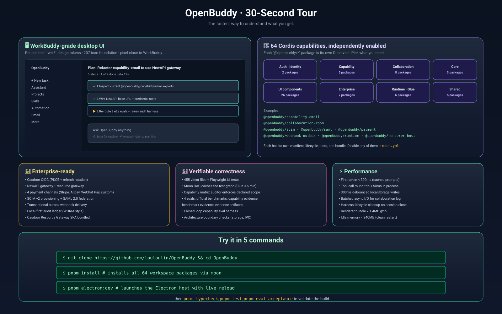
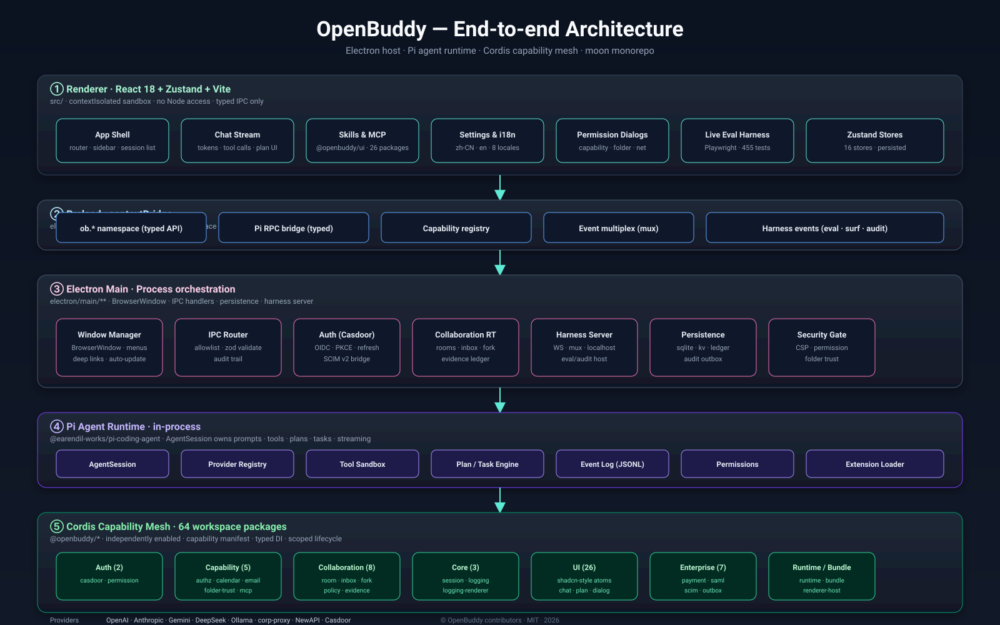
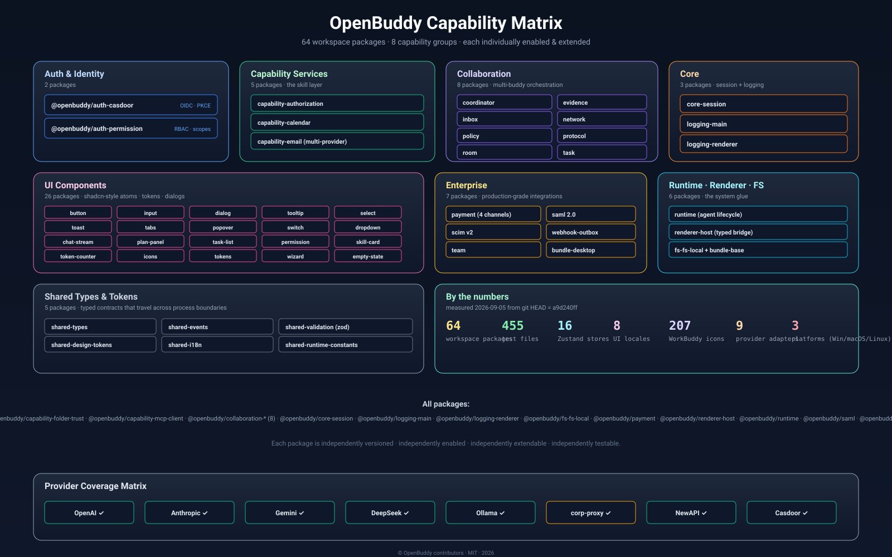

# OpenBuddy 文档索引

> 🌐 **语言:** [English](README.md) · **简体中文**

欢迎来到 OpenBuddy 文档索引。本目录是安装、运行、扩展和贡献 OpenBuddy 所需一切的**唯一真实来源**。

---

## 🇨🇳 简体中文 · 文档入口

> 📅 最近一次全面核验:2026-09-05 · 📦 对应版本:`0.14.0` · 🌿 git HEAD:`a9d240ff feat(pi-observability): forward session_tree / session_before_fork / provider hooks`

### 🚀 30 秒速览

  

### ⚡ 快速链接

| 我想…… | 看这个 |
|---|---|
| 第一次跑 OpenBuddy | [`GETTING_STARTED.md`](GETTING_STARTED.md) · [`GETTING_STARTED.zh-CN.md`](GETTING_STARTED.zh-CN.md) |
| 理解代码库 | [`ARCHITECTURE.md`](ARCHITECTURE.md) · [`ARCHITECTURE.zh-CN.md`](ARCHITECTURE.zh-CN.md) · [`CODEBASE_ANALYSIS.zh-CN.md`](CODEBASE_ANALYSIS.zh-CN.md) (2026-09-05 已核验清单) |
| 编写 Cordis 能力包 | [`PLUGIN_DEVELOPMENT.md`](PLUGIN_DEVELOPMENT.md) |
| 写测试 | [`TESTING.md`](TESTING.md) |
| 性能优化 | [`PERFORMANCE.md`](PERFORMANCE.md) |
| 让特性可访问 | [`ACCESSIBILITY.md`](ACCESSIBILITY.md) |
| 部署到生产 | [`OPERATIONS.md`](OPERATIONS.md) |
| 从 WorkBuddy 迁移 | [`WORKBUDDY_MIGRATION.md`](WORKBUDDY_MIGRATION.md) |
| 把 UI 翻译成新语言 | [`I18N.md`](I18N.md) |
| 与其他 AI 工具对比 | [`COMPARISON.md`](COMPARISON.md) |
| 找到常见问题答案 | [`FAQ.md`](FAQ.md) · [`FAQ.zh-CN.md`](FAQ.zh-CN.md) |
| 找到社区频道 | [`COMMUNITY.md`](COMMUNITY.md) |
| 看真实示例与 showcase | [`EXAMPLES.md`](EXAMPLES.md) |
| 理解发布流程 | [`RELEASING.md`](RELEASING.md) |
| 找安全 PGP key | [`SECURITY-PGP.md`](SECURITY-PGP.md) |
| 查术语 | [`GLOSSARY.md`](GLOSSARY.md) |
| 看全部环境变量 | [`ENVIRONMENT.md`](ENVIRONMENT.md) |
| 看接下来的规划 | [`ROADMAP.md`](ROADMAP.md) |
| 读架构决策历史 | [`adr/`](adr/) |
| 上报安全漏洞 | [`../SECURITY.md`](../SECURITY.md) |
| 获取帮助 | [`../SUPPORT.md`](../SUPPORT.md) |
| 贡献代码 | [`../CONTRIBUTING.md`](../CONTRIBUTING.md) · [`../CONTRIBUTING.zh-CN.md`](../CONTRIBUTING.zh-CN.md) |
| 理解项目治理 | [`../GOVERNANCE.md`](../GOVERNANCE.md) |
| 看谁是维护者 | [`../MAINTAINERS.md`](../MAINTAINERS.md) |

---

## 📚 文档结构(分类导航)

### 🏠 顶层(从这里开始)

- [`../README.md`](../README.md) · [`../README.zh-CN.md`](../README.zh-CN.md) — 主入口页
- [`../CONTRIBUTING.md`](../CONTRIBUTING.md) · [`../CONTRIBUTING.zh-CN.md`](../CONTRIBUTING.zh-CN.md) — 贡献者工作流
- [`../CODE_OF_CONDUCT.md`](../CODE_OF_CONDUCT.md) — 社区准则
- [`../SECURITY.md`](../SECURITY.md) — 漏洞披露
- [`../SUPPORT.md`](../SUPPORT.md) — 如何获取帮助
- [`../CHANGELOG.md`](../CHANGELOG.md) — 发布说明
- [`../LICENSE`](../LICENSE) — MIT 许可证

### 🚀 入门

- [`GETTING_STARTED.md`](GETTING_STARTED.md) · [`GETTING_STARTED.zh-CN.md`](GETTING_STARTED.zh-CN.md) — 30 分钟开发者上手
- [`FAQ.md`](FAQ.md) · [`FAQ.zh-CN.md`](FAQ.zh-CN.md) — 常见问题
- [`I18N.md`](I18N.md) — 翻译与本地化工作流
- [`COMPARISON.md`](COMPARISON.md) — OpenBuddy vs Cursor / Continue / aider / Copilot

### 🏗️ 架构与设计

- [`ARCHITECTURE.md`](ARCHITECTURE.md) · [`ARCHITECTURE.zh-CN.md`](ARCHITECTURE.zh-CN.md) — 分层架构深度剖析
- [`adr/`](adr/) — 架构决策记录(每个重要决策一篇)
- [`openbuddy-product-vs-pi.md`](openbuddy-product-vs-pi.md) — OpenBuddy 如何扩展 Pi
- [`pi-core-capabilities.md`](pi-core-capabilities.md) — Pi 核心能力
- [`pi-extension-architecture.md`](pi-extension-architecture.md) — Pi 扩展点
- [`pi-capability-gap-analysis.md`](pi-capability-gap-analysis.md) — 我们填补的能力空白
- [`pi-analysis-critique.md`](pi-analysis-critique.md) — 对 Pi 分析的批判
- [`pi-runtime-next-roadmap.md`](pi-runtime-next-roadmap.md) — Pi 运行时路线图
- [`pi-real-plugin-compatibility.md`](pi-real-plugin-compatibility.md) — Pi 插件兼容性
- [`pi-sdk-implementation-plan.md`](pi-sdk-implementation-plan.md) — SDK 实施计划
- [`expert-team-design.md`](expert-team-design.md) — 专家团队设计
- [`menu-architecture-audit.md`](menu-architecture-audit.md) — 菜单架构审计

### 🧩 能力与插件

- [`PLUGIN_DEVELOPMENT.md`](PLUGIN_DEVELOPMENT.md) — 构建你的第一个 Cordis 能力
- [`openbuddy-capability-matrix.md`](openbuddy-capability-matrix.md) — 逐包能力清单
- [`openbuddy-plugin-architecture.md`](openbuddy-plugin-architecture.md) — 插件架构
- [`openbuddy-plugin-catalog.md`](openbuddy-plugin-catalog.md) — 插件目录
- [`openbuddy-module-overlap-analysis.md`](openbuddy-module-overlap-analysis.md) — 模块重叠分析
- [`full-pluginization-plan.md`](full-pluginization-plan.md) — 完全插件化计划

### ⚔️ WorkBuddy 对等

- [`workbuddy-parity-matrix.md`](workbuddy-parity-matrix.md) — OpenBuddy vs WorkBuddy 对等矩阵
- [`workbuddy-points-system-comparison.md`](workbuddy-points-system-comparison.md) — 积分系统对比

### 🔄 迁移历史

- [`migration-pi-electron.md`](migration-pi-electron.md) — Pi → Electron 迁移记录
- [`moon-monorepo-refactor.md`](moon-monorepo-refactor.md) — moon monorepo 重构
- [`deepseek-cordis-runtime-status.md`](deepseek-cordis-runtime-status.md) — DeepSeek Cordis 运行时状态
- [`dsh-version-compatibility-matrix.md`](dsh-version-compatibility-matrix.md) — DSH 版本兼容矩阵

### 🏢 企业与商业

- [`casdoor-enterprise-auth.md`](casdoor-enterprise-auth.md) — Casdoor 企业认证
- [`casdoor-integration-matrix-v2.md`](casdoor-integration-matrix-v2.md) — Casdoor 集成矩阵 v2
- [`casdoor-new-api-openbuddy-commercial-architecture.md`](casdoor-new-api-openbuddy-commercial-architecture.md) — 商业架构
- [`casdoor-newapi-openbuddy-architecture-diagram.md`](casdoor-newapi-openbuddy-architecture-diagram.md) — 架构图(文本)
- [`new-api-casdoor-openbuddy.md`](new-api-casdoor-openbuddy.md) — NewAPI + Casdoor 集成
- [`newapi-integration-guide.md`](newapi-integration-guide.md) — NewAPI 集成指南
- [`new-api-channel-capability-matrix.md`](new-api-channel-capability-matrix.md) — NewAPI 通道能力矩阵
- [`enterprise-casdoor-newapi-openbuddy-architecture.md`](enterprise-casdoor-newapi-openbuddy-architecture.md) — 企业架构
- [`enterprise-completion-matrix.md`](enterprise-completion-matrix.md) — 企业完成度矩阵
- [`enterprise-live-verification-2026-08-29.md`](enterprise-live-verification-2026-08-29.md) — 现场核验(08-29)
- [`enterprise-live-verification-2026-08-30.md`](enterprise-live-verification-2026-08-30.md) — 现场核验(08-30)
- [`enterprise-live-verification-2026-08-31.md`](enterprise-live-verification-2026-08-31.md) — 现场核验(08-31)
- [`enterprise-live-verification-2026-09-01.md`](enterprise-live-verification-2026-09-01.md) — 现场核验(09-01)
- [`openbuddy-enterprise-integration-manifest.md`](openbuddy-enterprise-integration-manifest.md) — 企业集成清单
- [`openbuddy-token-billing-v2.md`](openbuddy-token-billing-v2.md) — token 计费 v2
- [`token-billing-and-reconciliation-architecture.md`](token-billing-and-reconciliation-architecture.md) — 计费架构
- [`openbuddy-credit-transfer.md`](openbuddy-credit-transfer.md) — 信用额度转账

### 🌐 分布式 Buddy(多 Agent)

- [`distributed-buddy-network-architecture.md`](distributed-buddy-network-architecture.md) — 分布式网络架构
- [`distributed-buddy-product-plan.md`](distributed-buddy-product-plan.md) — 分布式产品计划
- [`openbuddy-distributed-buddy-vision.md`](openbuddy-distributed-buddy-vision.md) — 分布式愿景
- [`openbuddy-distributed-buddy-research.md`](openbuddy-distributed-buddy-research.md) — 分布式研究
- [`openbuddy-distributed-buddy-plugin-and-ui-plan.md`](openbuddy-distributed-buddy-plugin-and-ui-plan.md) — 分布式插件 + UI 计划
- [`openbuddy-unified-buddy-product-plan.md`](openbuddy-unified-buddy-product-plan.md) — 统一 Buddy 计划

### 📧 邮件

- [`openbuddy-email-support-plan.md`](openbuddy-email-support-plan.md) — 邮件支持计划
- [`openbuddy-email-validation.md`](openbuddy-email-validation.md) — 邮件校验

### 💾 存储与数据

- [`storage-architecture-overview.html`](storage-architecture-overview.html) — 存储总览(HTML)
- [`storage-architecture-audit.md`](storage-architecture-audit.md) — 存储架构审计
- [`storage-architecture-audit.html`](storage-architecture-audit.html) — 存储审计(HTML)
- [`storage-verification-report.md`](storage-verification-report.md) — 存储核验报告
- [`build-output-conventions.md`](build-output-conventions.md) — 构建输出约定

### ⚙️ 运维

- [`release-ci.md`](release-ci.md) — 发布与 CI 流水线
- [`macos-signing.md`](macos-signing.md) — macOS 代码签名与公证
- [`deployment-guide.md`](deployment-guide.md) — 部署指南
- [`electron-testing.md`](electron-testing.md) — Electron 测试
- [`ai-agent-test-plan.md`](ai-agent-test-plan.md) — AI Agent 测试计划
- [`agent-evaluation-matrix.md`](agent-evaluation-matrix.md) — Agent 评估矩阵

### 💼 商业模式

- [`openbuddy-commercial-model.md`](openbuddy-commercial-model.md) — 商业模式
- [`publish-checklist-v0.15.0.md`](publish-checklist-v0.15.0.md) — v0.15.0 发布清单

### 🌏 社区

- [`COMMUNITY.md`](COMMUNITY.md) — 社区频道与中文社区
- [`ROADMAP.md`](ROADMAP.md) — 公开路线图

### 🎨 架构图

  

  

- [`diagrams/architecture-overview.svg`](diagrams/architecture-overview.svg) — 端到端架构总览
- [`diagrams/capability-matrix.svg`](diagrams/capability-matrix.svg) — 64 个包能力矩阵
- [`diagrams/data-flow-end-to-end.svg`](diagrams/data-flow-end-to-end.svg) — 数据流(提示词到工具结果)
- [`diagrams/workbuddy-parity.svg`](diagrams/workbuddy-parity.svg) — WorkBuddy 对等矩阵
- [`diagrams/tour-30s.svg`](diagrams/tour-30s.svg) — 30 秒速览
- [`diagrams/`](diagrams/) — 系统架构图目录
- [`casdoor-newapi-openbuddy-architecture-diagram.svg`](casdoor-newapi-openbuddy-architecture-diagram.svg) — Casdoor+NewAPI+OpenBuddy 架构图
- [`openbuddy-transformation-plan.html`](openbuddy-transformation-plan.html) — 转型计划(HTML)
- [`analysis/`](analysis/) — 分析报告

### 📊 分析报告

研究、审计与差距分析,记录了 OpenBuddy 设计决策背后的依据。

- [`analysis/codebase-inventory.md`](analysis/codebase-inventory.md) — 完整文件/模块清单(2026-09-01 更新)
- [`analysis/gap-report.md`](analysis/gap-report.md) — 与 WorkBuddy / Pi / Continue 的功能差距
- [`analysis/permissions-safety-gap.md`](analysis/permissions-safety-gap.md) — 权限模型审计
- [`analysis/storage-sync-gap.md`](analysis/storage-sync-gap.md) — 存储同步覆盖分析
- [`analysis/eval-evidence-gap.md`](analysis/eval-evidence-gap.md) — 评估覆盖分析
- [`analysis/docs-dx-gap.md`](analysis/docs-dx-gap.md) — 文档开发者体验差距
- [`analysis/best-package-design.md`](analysis/best-package-design.md) — 包设计模式评审
- [`analysis/ci-release-gap.md`](analysis/ci-release-gap.md) — CI & 发布流水线审计
- [`analysis/codex-app-specific-gap.md`](analysis/codex-app-specific-gap.md) — 桌面应用功能差距
- [`analysis/deploy-commercial-gap.md`](analysis/deploy-commercial-gap.md) — 部署与商业就绪度
- [`analysis/electron-host-security.md`](analysis/electron-host-security.md) — Electron host 安全审计
- [`analysis/modularization-analysis.md`](analysis/modularization-analysis.md) — 模块化评分
- [`analysis/pi-runtime-gap.md`](analysis/pi-runtime-gap.md) — Pi 运行时功能差距
- [`analysis/provider-auth-gap.md`](analysis/provider-auth-gap.md) — Provider 认证覆盖
- [`analysis/renderer-workbuddy-parity.md`](analysis/renderer-workbuddy-parity.md) — 渲染层 UI 对等矩阵
- [`analysis/skills-plugin-mcp-gap.md`](analysis/skills-plugin-mcp-gap.md) — skills / plugins / MCP 分析

### 📜 架构决策记录(ADR)

完整架构决策历史见 [`adr/`](adr/)。

---

**文档是特性,不是负担。**

发现文档过时或有错误?在 [Issues](https://github.com/louloulin/OpenBuddy/issues/new?labels=docs) 提单,或在微信群 / Discord 反馈。

