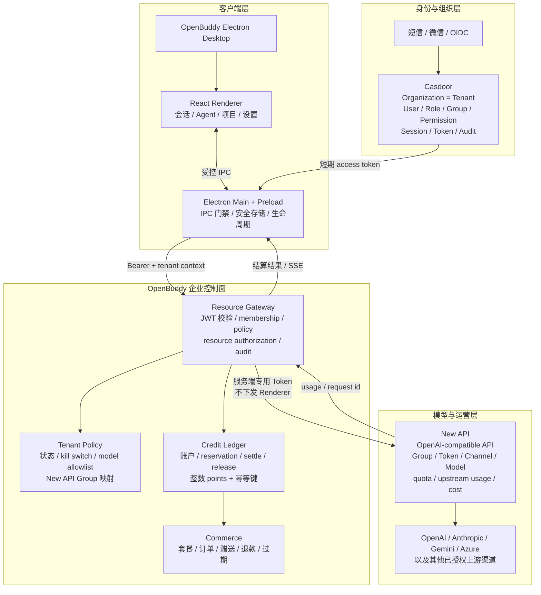
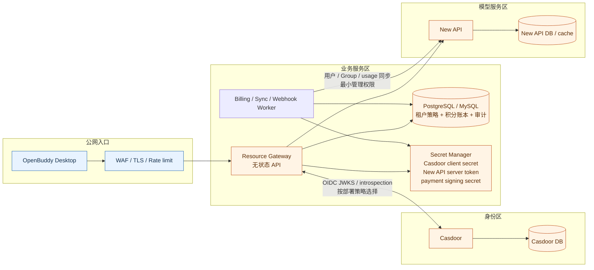
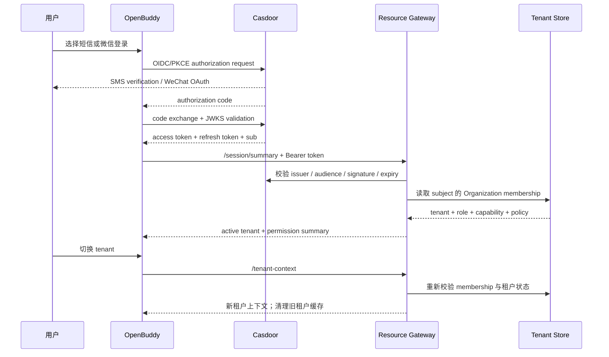
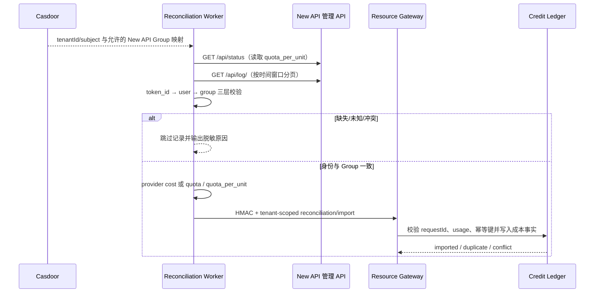

# Casdoor × New API × OpenBuddy 企业商业化架构

> 商业模型的可执行定价、成本和毛利门禁见 `docs/openbuddy-commercial-model.md`；发布前运行 `scripts/audit-commercial-model.mjs`。

## 结论

三套凭据和三种额度必须分离：

| 层 | 责任 | 不能替代 |
| --- | --- | --- |
| Casdoor | OIDC/PKCE、微信/短信 Provider、Organization 多租户、用户/角色/群组/权限、会话撤销、审计入口 | 不负责模型路由和 OpenBuddy 商品积分 |
| OpenBuddy Resource Gateway | 租户策略、工作台权限、积分账户、不可变账本、预扣/结算/释放、业务审计、New API 代理 | 不保存 Casdoor 主数据，不承担上游模型渠道管理 |
| New API | OpenAI-compatible API、渠道聚合、模型路由、失败重试、分组、API Token、上游成本与用量、管理台 OIDC | 不理解 OpenBuddy 的完整租户权限和商品积分 |

```text
微信/短信/OIDC
       │
       ▼
    Casdoor ── Organization / role / permission / subject
       │ JWT
       ▼
OpenBuddy Desktop ── 本地 agent、会话、模型选择；Renderer 不持有长期 New API Token
       │ Bearer access token
       ▼
Resource Gateway ── Casdoor 校验 → 租户策略 → 积分预扣 → New API 代理 → usage 结算
       │ dedicated server-side New API token
       ▼
    New API ── Group / Token / channel / model / upstream usage
```

## 总体架构设计图

下面的设计把“身份事实源”“企业资源授权”“模型调用与成本”“产品积分”拆成四个边界。OpenBuddy 不直接修改 Casdoor，也不让 New API 充当企业身份源；两者通过 Resource Gateway 以最小权限连接。



### 部署与信任边界



生产部署原则：Gateway 与 Worker 可以水平扩展；生产账本必须使用 PostgreSQL/MySQL 等事务存储，JSON store 仅用于单实例开发/离线场景；Redis Adapter 不是 OpenBuddy 的登录连接器，只有在需要跨副本缓存、限流或短期会话共享时再作为可选基础设施加入。Gateway 商业目录、报价和生产 AI 代理共用同一售卖门禁，按输入/输出 token 方向的保守毛利下限执行 fail-closed；个人套餐可授予租户级订阅权益，共享钱包套餐只授予钱包积分，支付、财务对账和退款仍由独立业务系统最终确认。

### 登录、租户切换与权限数据流



短信和微信入口在代码中已经抽象为 Casdoor Provider 能力，但只有在 Casdoor 中配置真实 Verification Code/SMS Provider、WeChat OAuth Provider、回调地址和开放平台凭据后，才算完成真实联调。登录方式不能绕过 Organization membership；租户切换也不能只由 Renderer 修改本地状态。

截至本轮环境核验，Casdoor `http://124.221.146.145:8000` 的 `admin/openbuddy` 应用（client id `005d6839fe25abd6696f`）仍返回：`redirectUris=[]`、`scopes=[]`、`enableCodeSignin=false`；应用只绑定不可登录的 Captcha Provider，没有可登录的 SMS 或 WeChat Provider。因而当前环境的企业 OIDC、短信和微信登录均未达到真实端到端可用状态；代码会在 UI 中明确显示配置缺口并禁用对应按钮，不会伪造登录成功。生产配置必须使用 `casdoor://localhost/callback`，与 Electron 主进程的协议注册和回调校验保持一致。

### 一次 AI 请求与积分结算

```mermaid
sequenceDiagram
  participant R as Renderer
  participant M as Electron Main
  participant G as Resource Gateway
  participant L as Credit Ledger
  participant N as New API
  participant P as Upstream Model

  R->>M: sendMessage(model, input, idempotencyKey)
  M->>G: tenant + subject + session + model + Bearer
  G->>G: Casdoor 校验 + member revoke + policy + model allowlist
  G->>L: reserve(tenant, subject, estimate, idempotencyKey)
  alt 余额不足或策略拒绝
    L-->>G: reject
    G-->>M: 402 / 403 + stable error code
  else 允许调用
    G->>N: server-side token + mapped Group
    N->>P: OpenAI-compatible request
    P-->>N: response + usage
    N-->>G: response + usage + request id
    G->>L: settle(actual usage, upstream cost)
    L-->>G: committed ledger entry
    G-->>M: response / SSE + points settled
    M-->>R: render result; never expose New API token
  end
```

结算必须满足 `authorize ∧ reserve ∧ upstream_success`；上游失败、超时或客户端取消时释放 reservation。流式请求要求 New API 返回最终 usage 块；没有 usage 时只能按明确的降级策略处理，不能静默把估算值当作真实成本。`tenantId`、`subject`、`sessionId`、`newApiRequestId` 和 `idempotencyKey` 是对账主键，积分余额只接受服务端账本事件变更。

客户端在选择 `new_api/*` 模型前会从 Gateway 读取 `/v1/tenants/{tenantId}/ai/capabilities`。Gateway 配置了明确能力目录时，客户端和服务端都会阻断已标记不支持的协议；未配置目录时保持兼容但不把未验证能力伪装成已验证能力。Renderer 只通过受控 IPC 获取目录，Casdoor access token 和 New API server-side token 均不下发到 Renderer。

企业用户登录并选择租户后，Electron Main 会从 Gateway 的 `/ai/catalog` 读取当前租户通过定价、成本和毛利门禁的 `sellable` 模型，自动维护租户隔离的 `new_api` Provider 配置并刷新模型列表。Provider 的 `baseUrl` 只指向当前租户的 Gateway AI 路径；Casdoor access token 仅注入 Pi 的运行时凭据，绝不写入 `models.json`、Renderer 或 New API 管理配置。模型目录请求失败时保留现有配置，不用缓存目录伪装成可售模型；重新登录、切换租户或重建 Agent 时会重新同步，避免跨租户模型和计费上下文泄漏。

### 成本对账与租户归属



Worker 的推荐映射文件使用 `groups`、`users`、`subjects`、`tokens` 四个命名空间。`groups` 只绑定 `tenantId`，`subjects`、`tokens` 和 `users` 的 `tenantId/subject` 必须一致；日志中的 `group`、Gateway 注入的 `subject/actor` 必须存在并属于同一租户。任一校验失败都不能回退到默认租户。New API 的 `quota` 仍是内部额度单位，只有读取并核对实例 `quota_per_unit` 后才可标记为 `provider-reported-quota`；它不能直接当作人民币、美元或 OpenBuddy 积分。映射文件不保存任何 API 密钥，管理 Token 只存在 Worker 的 Secret Manager 环境中。

产品积分和 New API 配额采用两套不可替代的公式：

```text
OpenBuddy points = max(minimumPoints,
  ceil(promptTokens / 1000) * inputPointsPerThousand +
  ceil(completionTokens / 1000) * outputPointsPerThousand)

New API quota = groupRatio * modelRatio *
  (promptTokens + completionTokens * completionRatio)
```

前者决定客户账户扣费，后者只用于供应商成本核对；任何一方都不能直接替换另一方。

### 数据与凭据归属

| 数据/凭据 | 权威系统 | OpenBuddy 使用方式 | 明确禁止 |
| --- | --- | --- | --- |
| 用户、组织、角色、登录会话 | Casdoor | 读取 OIDC claims、membership 和撤销状态 | 在 OpenBuddy 复制一套本地用户主数据 |
| 能力、资源、租户策略 | Gateway + Casdoor permission | Main 进程做最终门禁，Gateway 做服务端复核 | 只相信 Renderer 的 `tenantId` 或按钮状态 |
| New API Group、渠道、模型、上游成本 | New API | Gateway 通过服务端管理/运行 API 使用 | 把 New API Group 当成身份源 |
| 商品积分、订单、预扣、结算、退款 | Gateway ledger | 通过受保护 IPC/API 展示余额与流水 | 客户端直接增加余额或修改账本 |
| Casdoor client secret、New API token、支付签名密钥 | Secret Manager | 仅 Main/Gateway/Worker 读取 | 写入 Renderer、日志、账单或 Git |

## 当前实现进度评估

本轮复核确认 New API 实例仍为 `v1.0.0-rc.22`；渠道 `OpenBuddy MiniMax M3`（ID `2`）已启用、上游凭据已通过管理台写入、管理台模型测试成功，MiniMax-M3 的 New API 价格倍率也已核验。使用一次性低额度 Token 真实验证了 `/v1/models`、Chat Completions、真实 usage、删除和删除后复核；Chat/usage/删除闭环通过。对同一 MiniMax channel 实测 Completions/Embeddings/Rerank 返回 `unsupported relay mode`，Responses 返回 `not implemented`，这是 New API/MiniMax adaptor 的能力边界，不是 Gateway 积分预扣或结算错误。Casdoor 应用仍缺回调、OIDC scopes、SMS 和 WeChat Provider。仓库内新增了 Rerank 计费代理，并修复 JSON 文件适配器并发写入的临时文件名竞态：同一毫秒的并发积分请求此前可能出现 `ENOENT`/HTTP 500，现改用随机临时文件名并由并发余额测试证明只允许一个请求预扣成功。

以下百分比是基于当前仓库功能和已跑过的 focused tests 的工程估算，不等于生产上线比例：

| 能力域 | 当前进度 | 已有能力 | 主要缺口 |
| --- | ---: | --- | --- |
| Casdoor OIDC/PKCE 与生命周期 | 80% | 登录、刷新、注销、会话事件、主进程 token 边界 | 真实环境凭据、回调和撤销联调 |
| 短信 / 微信登录 | 55% | Provider 探测、入口和配置提示 | SMS/WeChat 平台配置、真实端到端验收 |
| 多租户与 RBAC | 78% | Organization → tenant、membership、角色/能力映射、租户切换清理、成员撤销和 SQL CAS 请求状态 | 公网 Gateway、生产数据库/Secret Manager 和跨副本真实演练 |
| 工作台资源授权 | 80% | Main IPC 门禁覆盖 agent/model/skill/MCP/memory/session/task/plan 等资源 | 远程资源目录和完整租户级配置中心 |
| New API 模型网关 | 91% | Provider 预设、租户 Gateway 模型发现、能力目录、客户端/服务端协议门禁、MiniMax 渠道和价格、Chat/SSE、非流式协议代理、Moderations 输入 usage 计费、Group→Token 显式映射、Group 漂移门禁、上游失败释放积分、无 usage 拒绝结算、Chat/usage/Token 删除真实闭环 | 其他渠道的真实协议联调、多媒体/Realtime、重试/限流压测 |
| 积分与计费 | 97% | 整数账本、预扣/结算/释放、订单、退款、按批次 FIFO 有效期/过期流水、幂等外部成本导入、Token→用户→Group 成本归属校验、成本对账、单位经济性和可执行 SKU/毛利审计、企业共享钱包（owner/spender/viewer 三级 RBAC、跨成员共享余额、AI 头 `x-openbuddy-wallet` 扣费、wallet 级 grant/订单/退款/过期/对账）；Worker 已将 Gateway 注入的 wallet 维度从 New API 日志回填到外部成本记录并接受请求级一致性校验 | 支付渠道、财务系统、跨区域并发与灾备演练 |
| 生产运维与合规 | 61% | SQL 生产 Compose、启动 fail-closed、自检、Worker systemd/timer 模板、checkpoint/重叠窗口、备份恢复、健康/审计面板、远端 Gateway health/ready 实例可达 | 真实密钥托管、HTTPS、SIEM、告警、SLO、渗透和灾备验收 |

综合判断：**代码实现能力约 96%**，**生产商业化约 72%**。当前可验证证据包括：New API `v1.0.0-rc.22` 状态、`quota_per_unit=500000`、未授权模型面 `401`；Resource Gateway `healthz/readyz=200` 且使用 PostgreSQL；本轮 Gateway `117/117`、Electron/IPC `28/28`、根 TypeScript、构建和商业审计均通过；Worker 已具备 Token→用户→Group 三层租户归属校验、远端 Group 漂移门禁和成功后 checkpoint/重叠窗口重放；Gateway 的目录、报价和生产代理已共用同币种、分项毛利下限门禁。共享钱包退款已增加购买批次完整性回归，禁止已消费/过期批次通过后续充值补足后退款。剩余工作是 Casdoor 回调/SMS/WeChat 真实配置、生产 HTTPS/Caddy、Secret Manager、provider-reported 成本源、支付渠道、SIEM/SLO、普通成员跨租户和灾备验收；这些需要外部凭据或生产环境操作，不能由代码测试替代。

## 后续落地路线

1. **环境闭环**：在 Casdoor 创建正式应用，配置精确 callback URI、`openid profile email phone offline_access` scopes、SMS Provider 和 WeChat Provider；New API 已配置 MiniMax 渠道和价格，Chat/usage/删除及本地 Gateway 三方 Chat 闭环已用独立短期 Token 验收；后续按渠道能力补齐其他协议或在产品目录中明确不可用协议。
2. **Gateway 生产化**：将 Resource Gateway 从本地 fallback 提升为独立服务，接入 PostgreSQL/MySQL、secret manager、TLS、WAF、限流、健康检查和审计投递；禁止桌面端直连 New API 管理接口。
3. **身份同步**：以 Casdoor `issuer + sub + tenantId` 为稳定外部键，维护 New API user/group/token 映射；同步服务只拥有必要管理权限，成员禁用和租户停用触发撤销/冻结。
4. **计费验收**：非流式 usage 与 SSE 最后一帧 usage 已通过单租户公网验收；仍需覆盖 429/5xx、超时、取消、重复幂等键、余额不足、退款、过期、支付签名重放和账本 CAS 冲突。
5. **企业治理**：补齐租户管理员、账单管理员、审计员、开发者、成员、访客的最小权限矩阵；接入 SIEM、告警、数据留存/删除、导出和管理员操作审批。
6. **商业化发布**：先上线 Free/Team，验证积分消耗与成本毛利；再开放 Enterprise 合同额度、私有 Group、模型白名单、SLA 和私有化部署；Redis 仅在出现明确的跨副本共享状态需求时引入。

## 接入验收标准

上线前必须能用自动化或可重复脚本证明：

- 同一用户在两个 Organization 中的资源、会话、积分和审计互不可见；切租户时旧数据不闪现。
- Renderer 无法调用 New API 管理接口，也无法读取 Casdoor refresh token、New API server token 或支付密钥。
- 未登录、成员已撤销、租户已停用、模型不在 allowlist、积分不足时分别返回稳定错误码，不伪造成功。
- 同一 `idempotencyKey` 重试不会重复预扣或结算；上游失败和断流最终释放预扣。
- 对账同时展示 `pointsSettled` 与外部成本，并区分 `provider-reported`、`provider-reported-quota` 与 `configured-pricing`；New API `quota` 只表示内部配额单位，必须先核对实例 `QuotaPerUnit` 后才能推导 USD。
- 短信、微信、OIDC 三种登录均能完成 callback、刷新、注销、撤销和重新登录；未配置 Provider 时 UI 明确提示配置缺口。

## New API 文档能力映射

官方文档的管理面覆盖用户认证、用户/分组、Token、Token 用量、渠道、模型、系统定价与充值接口；模型面覆盖 `/v1/models`、Chat Completions、Responses、Completions、Embedding、Rerank、图像、音频和 Realtime。OpenBuddy 当前通过受控 Gateway 使用其中已有真实 usage 结算契约的协议，不假设 New API 管理 API 的私有字段或版本契约。

推荐映射：

| Casdoor / OpenBuddy | New API | 说明 |
| --- | --- | --- |
| `tenantId` | Group | 作为路由、额度和模型范围的执行映射，不把 Group 当成身份源 |
| Casdoor `sub` | New API user/token owner | 只有同步服务或网关可以维护映射；不把长期 token 放进 Renderer |
| OpenBuddy `plan` | Group + Gateway credit pricing | New API 负责成本和上游限额，Gateway 负责商品计费 |
| OpenBuddy `billing.read/write` | New API 管理 API 的最小管理权限 | 管理动作必须由 Gateway 主进程门禁和审计 |
| New API usage | `prompt_tokens` / `completion_tokens` | 只用于 OpenBuddy 账本结算和成本对账，不直接当积分余额 |

## 真实实例验收记录（2026-08-30）

针对配置的 New API 实例执行了真实管理员登录、MiniMax 渠道管理台测试、模型价格读取、临时 Token 创建、Token 列表确认、明文 Key 取回、`/v1/models` 模型发现、Chat 调用、真实 usage 查询、Token 删除和列表复核。历史临时 Token `17`、`18`、`20`、`22`、`23`、`28`、`29` 均已删除；本轮独立复核使用临时 Token `55`，也已删除并确认列表无残留。通过 Gateway 额外验证了非流式 Chat 和 SSE Chat 的积分预扣、usage 结算、账本与 reconciliation。Completions、Embeddings、Rerank 分别返回 `unsupported relay mode: 2/3/32`，Responses 返回 `not implemented`，故这些协议对当前 MiniMax channel 标记为不支持，不能纳入该渠道的商业套餐。完整边界见 `docs/enterprise-live-verification-2026-08-30.md`。

结论：New API 渠道配置、价格配置、独立 Token Chat/usage 和删除闭环已真实完成；当前版本 `/api/usage/token/` 的 `total_used` 是服务端明确标注的“不支持”字段，官方 `/api/log/stat` 需要管理员权限，因此外部财务对账由独立 Worker 使用最小管理权限读取日志统计或导出报表，再通过 Gateway 幂等成本导入接口落库。本轮已用真实 Casdoor JWT 在公网 Gateway 完成 `built-in` 租户的非流式与 SSE Chat 积分发放、预扣、结算、账本和 reconciliation；仍不能宣称多租户生产、短信/微信、支付、HTTPS 或全部协议商业化全链路完成。

## 计费闭环

1. Gateway 验证 Casdoor JWT、Organization membership、成员撤销名单、租户状态、kill switch 和模型白名单。
2. 根据 `model + plan` 估算积分并用幂等键创建 `reservation`；AI 请求对 prompt 采用保守上界预扣，余额不足返回 `402`，不会请求 New API。真实 usage 超出预扣时，只要扣除其他 reservation 后余额足够就按实际积分补扣；余额不足返回 `402 INSUFFICIENT_CREDITS_FOR_ACTUAL_USAGE`，不向客户端返回模型结果，并释放预扣。租户每日 token 配额与积分预算和 reservation 在同一串行事务中原子检查，`tokensUsedToday + tokensReservedToday` 或 `pointsUsedToday + pointsReservedToday` 超限返回 `429`；实际结算超过积分预算时 fail-closed 释放 reservation，不生成 consume。失败/取消/结算会释放或替换 token/points 预留。
3. Gateway 使用服务端 Group 专用 Token 调 New API 的协议路由；多租户通过 `NEW_API_GROUP_TOKENS_JSON` 显式绑定 Group→Token。当前已验证的 MiniMax-M3 channel 仅允许 `/v1/chat/completions`（含 SSE）；`/v1/completions`、`/v1/responses`、`/v1/embeddings` 和 `/v1/rerank` 必须由能力目录拒绝。`/v1/moderations` 已接入租户隔离和输入 usage 结算，但在目标 channel 完成真实 usage 验收前不得纳入商业套餐。
4. 非流式从响应 `usage` 结算；流式要求 `stream_options.include_usage=true`，读取最后 usage 块。生产默认 `NEW_API_ALLOW_ESTIMATED_USAGE=0`，缺少真实 usage 时返回 `NEW_API_USAGE_REQUIRED` 并释放预扣，避免把估算值当成真实商业扣费。
5. Gateway 对每个 `New API Group + model` 维护内存熔断器：连续 408/429/5xx 或超时达到阈值后返回 `NEW_API_UPSTREAM_CIRCUIT_OPEN`，不创建积分预扣；熔断窗口结束只放行一个半开探测，成功恢复，状态通过 Prometheus 指标暴露。协议不支持和客户端主动取消不计入通道健康失败。熔断状态是实例级内存状态，多副本部署仍需结合负载均衡摘除和外部监控执行跨实例治理。
6. 上游 4xx/5xx、429、超时或客户端断开释放预扣；重复请求使用同一个幂等键，不重复扣费；请求声明和最终响应写入 Resource Store，SQL 多副本可在租约到期后接管或重放。
7. 待支付订单超过 `expiresAt` 时由计费 API 自动幂等收敛为 `expired`；迟到的 `paid` 回调先落库过期状态并拒绝发放积分。
8. 所有积分金额使用整数 points；账本记录 `tenantId`、`subject`、模型、token、New API request id、计划和审计 request id。
9. 账本同时记录 `newApiGroup`、`agentId`、`sessionId` 和 `usageSource`；`usageSource=new-api` 才代表 New API 返回了实际用量，`estimated` 仅用于上游未返回 usage 的兼容降级，并进入对账的 `estimatedUsageEntries`；财务上线门槛是 `estimatedUsageEntries=0`。
10. 订单退款必须同时满足余额足够且可用余额（`balance - reserved`）足够；存在进行中的 AI 预扣时拒绝退款，避免退款后账户可用余额为负。

11. 商业对账报告的 `commerce` 汇总订单和退款状态，并按原币种保留 `amountMinor`；Gateway 只提供运营摘要，不承担财务总账或汇率换算。多币种收入、税费和结算差异必须进入财务系统统一核算。
12. `economics` 将 OpenBuddy 产品收入、New API 已核验成本和未匹配成本分层；贡献毛利仅对同币种且已匹配 `newApiRequestId` 的数据计算，缺证据时不估算。
13. 成本 Worker 导入时，`importKey` 提供批次幂等，`newApiRequestId` 提供请求级唯一性；若 OpenBuddy 已有对应消费流水，外部记录的主体、模型和 token usage 必须逐项一致，否则拒绝进入对账事实源。

14. Electron Main 的企业 Pi runtime 使用 `before_provider_headers` 扩展点注入 `x-openbuddy-agent`、`x-openbuddy-session` 和可选的 `x-openbuddy-wallet`；Gateway 和 Worker 以这些维度及 `newApiRequestId` 建立 Agent 工作台的成本归属。非 `new_api` Provider 不注入企业计费头。

## 商业模型

- Free：由租户管理员或注册编排流程调用 `POST /credits/welcome` 显式发放带 `pointsValidDays` 的体验积分；Gateway 从零价格 Free 套餐读取金额，只允许每个租户主体发放一次，并拒绝复用普通 grant 的幂等键。Gateway 不会因为普通读取或首次请求隐式增加余额，避免绕过审计和反滥用策略。
- Team：按席位/周期购买积分，租户管理员可发放、查看成员流水，Group 限制团队模型。
- Enterprise：合同额度、私有 New API Group、模型白名单、SLA、集中 SIEM、租户级审计和自定义价格。共享钱包通过显式 `POST /v1/tenants/{tenantId}/wallets` 创建并由租户/全局管理员维护成员；桌面端“扣费账户”面板只展示当前主体有 `owner/spender` 权限的钱包，选择按 `tenantId + subject` 隔离并持久化；计费链路 grant/billing/orders/refund/reserve/settle/release 均已 wallet-aware；AI 调用方必须持有 `spender`（或更高）角色才能用 `x-openbuddy-wallet` 扣费；Ledger、过期、退款、对账和审计都自动归属到对应 walletId，不再通过 `subject` 字符串模拟。
- 充值、赠送、退款、过期、人工调整均写入不可变账本；支付回调只允许服务端使用幂等订单号，不直接从客户端加余额。
- `paid` 支付回调还必须携带 `amountMinor`、`currency`，且两者必须与订单创建时快照完全一致；缺失或不一致时即使 HMAC 正确也不得发放积分。
- New API 的倍率、渠道成本和 OpenBuddy 的商品积分价格分开维护；财务对账同时保留 `upstreamCost` 与 `pointsSettled`。
- Gateway 定价快照进一步分离 `input/output points per thousand` 与 `input/output cost per million`；quote 可返回供应商成本、币种和 `costBasis`，但最终客户扣费仍只由积分定价和真实 usage 决定。
- New API 官方管理面提供用户、Group、Token、渠道、模型、日志、用量和支付接口；OpenBuddy 只通过服务端专用 Token 调用 AI 代理，管理面同步与外部账单导入应由独立 Worker 执行，不能让桌面端持有管理 Token。

## 安全边界

- Casdoor access token 仅在 Electron main / Gateway 使用；不进入 React 状态、日志、账单或 New API 上游请求体。
- New API 长期 Token 仅注入 Gateway secret manager；桌面端只调用 Gateway 的租户 AI 路由。
- Casdoor 支持多租户的关键实体是 Organization；New API Group 只是执行层映射，不是租户主数据。
- 微信登录要求 Casdoor 配置真实 WeChat Provider 与开放平台凭据；短信登录要求 Verification code 方法和 SMS Provider。代码入口已具备，但没有凭据时不能声称真实登录已联调。
- Redis Adapter 不是 OpenBuddy 身份连接器；它只适合 New API 多副本缓存/限流/会话等共享状态。本方案账本先使用现有 JSON/Postgres/MySQL store，跳过 Redis。
- SQL 生产 store 的整状态写入使用 `resource_state.revision` 乐观 CAS；并发冲突会重新读取并重放有限次数，避免多副本覆盖积分账本。JSON store 只支持单实例开发/离线场景，不作为生产多副本事实源。

## 已实现与后续

已实现：Casdoor OIDC/PKCE、微信/短信入口探测、多租户与权限管理、工作台主进程门禁、New API Provider、Resource Gateway、整数积分账户、不可变流水、幂等预扣/结算/释放、套餐目录、订单状态机、HMAC 支付回调、退款/过期、积分 IPC 和账户页展示、New API 代理 OpenAPI 契约。

套餐目录写权限仅授予全局管理员或专用 `billing.catalog.write` 权限；租户管理员不能通过普通 `billing.write` 改写全局商品定义。模型列表、非流式 usage 和 SSE 最后一帧 usage 已在单租户公网闭环中验证；后续必须用独立测试 New API Token 做联调：429/超时退款、客户端取消、租户隔离、成员撤销、New API Group 映射、真实支付签名回调和财务对账。真实微信/SMS Provider、支付渠道和生产支付回调需要运营凭据和部署方配置，不能由代码仓库伪造。
