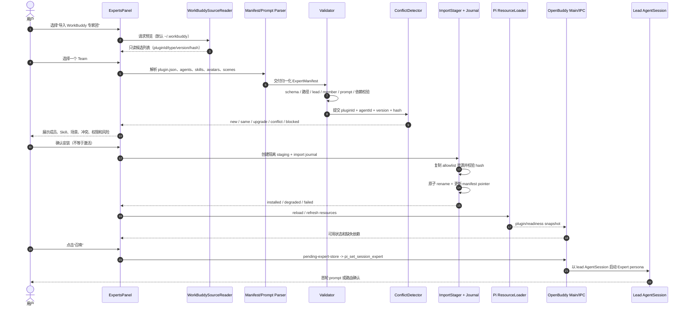
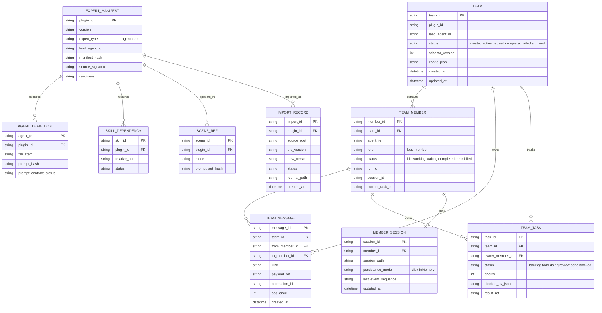
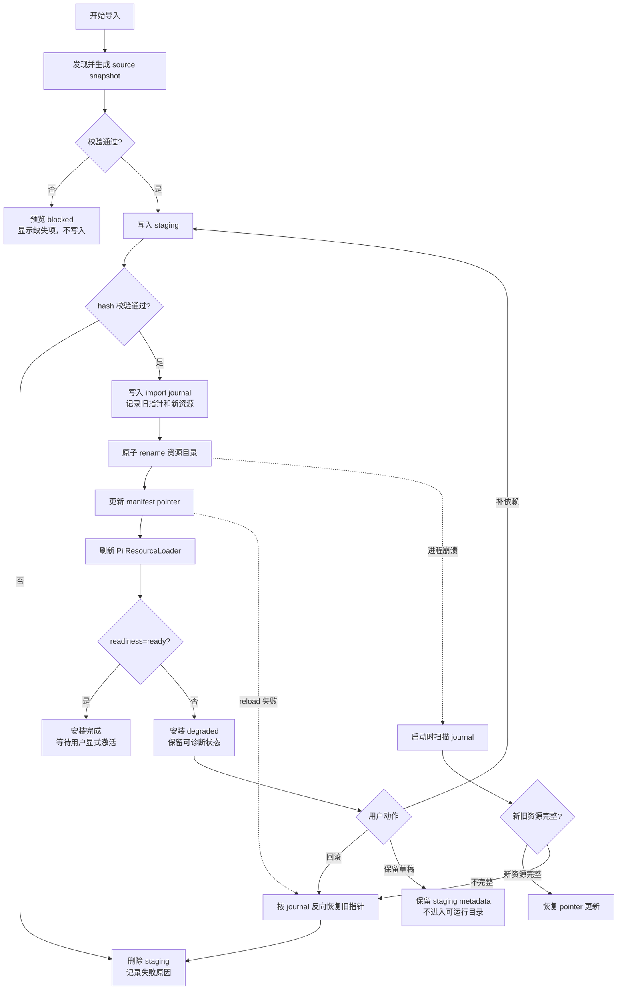

# OpenBuddy 专家团迁移与运行时架构图

> 说明：图中“当前”表示仓库已存在的可观察实现；“目标”表示 WorkBuddy 专家团迁移和 Pi-first Team runtime 的设计建议。WorkBuddy 私有后端、商业账号、授权服务和未公开协议不在图中展开。

实现落点：本地导入服务位于 `electron/main/workbuddy-import.ts`，通过 `electron/main/ipc.ts` 和 `electron/preload/index.ts` 暴露 `workbuddy_import_preview/confirm/status/rollback`，Renderer 入口位于 `src/components/experts-panel/experts/ExpertsTab.tsx`。导入只写 `~/.pi/agent/workbuddy-experts` 及 journal，结果带 `autoActivated: false`；Team coordinator、mailbox 和持久化 member session 仍是后续 Pi-first 设计。

## 1. 总体架构

```mermaid
flowchart TB
  user[用户]

  subgraph wb[WorkBuddy 本机可观察配置 ~/.workbuddy]
    wb_manifest[plugins/marketplaces/*/plugins/*/plugin.json]
    wb_agents[agents/*.md]
    wb_skills[skills/*/SKILL.md]
    wb_assets[avatars/*]
    wb_scenes[cb_teams_marketplace/scenes.json]
    wb_recommend[skill-recommend-experts/connectors]
    wb_cache[app/cache/experts metadata/version]
    wb_selection[experts/custom experts.json]
    wb_schema[SQLite migrations]
  end

  subgraph import[已实现：WorkBuddy 本地导入层]
    reader[workbuddy-import.ts\n只读 + allowlist 投影]
    parser[PluginManifestParser\nJSON + 路径规范化]
    validator[Manifest/Prompt/Dependency Validator]
    conflict[ConflictDetector\nID + version + hash]
    preview[Import Preview\n用户确认]
    staging[staging\n隔离目录 + 原子 rename]
    journal[import journal\nrollback / recovery / idempotency]
    adapter[Expert manifest index\n-> ExpertItem / Pi resources]
  end

  subgraph electron[OpenBuddy Electron Main]
    ipc[IPC handlers + preload allowlist\nworkbuddy_import_*]
    host[agent-host.ts\nPi host + TeamRunner]
    bridge[脱敏 Team event bridge]
  end

  subgraph pi[Pi Runtime]
    loader[DefaultResourceLoader\nextensions / skills / prompts]
    lead[Lead AgentSession]
    coordinator[Team Coordinator\n状态机 + semaphore + pause/resume]
    member1[Member AgentSession\nagentRef=plugin/agent]
    member2[Member AgentSession\nagentRef=plugin/agent]
    session[SessionManager\n持久化或 inMemory]
    hooks[subagent/start|end\nagent/start hooks]
    mailbox[Mailbox\n消息中转 + correlation]
    tasks[Task Board\nbacklog/todo/doing/review/done]
  end

  subgraph renderer[OpenBuddy Renderer]
    market[ExpertsPanel\nExpertCard / Detail / Import Preview]
    pending[pending-expert-store]
    teamstore[team-runtime-store\n版本化 event snapshot]
    teamui[TeamStatusView / ColleaguesPanel]
    chat[ChatView / Composer]
  end

  user --> market
  wb_manifest --> reader
  wb_agents --> reader
  wb_skills --> reader
  wb_assets --> reader
  wb_scenes --> reader
  wb_recommend --> reader
  wb_cache --> reader
  wb_selection --> reader
  wb_schema --> reader
  reader --> parser --> validator --> conflict --> preview
  preview -->|确认安装| staging
  staging --> journal
  staging --> adapter
  adapter --> loader
  adapter --> market
  market -->|用户明确召唤| pending --> ipc --> host
  host --> lead
  lead -->|team_create / route| coordinator
  coordinator --> member1
  coordinator --> member2
  coordinator <--> mailbox
  coordinator <--> tasks
  member1 <--> mailbox
  member2 <--> mailbox
  lead --> session
  member1 --> session
  member2 --> session
  member1 --> hooks
  member2 --> hooks
  coordinator --> bridge --> teamstore --> teamui
  lead --> chat
  host --> loader
  loader --> lead
  market -.不自动激活.-> chat
```

## 2. 专家团迁移时序



## 3. Team 数据模型与事件



事件统一使用 `team_event` envelope：

```json
{
  "schemaVersion": 1,
  "type": "member_status | message | task_updated | paused | resumed | finished",
  "teamId": "team-id",
  "memberId": "plugin/agent-id",
  "runId": "run-id",
  "sessionId": "session-id",
  "sequence": 42,
  "payload": { "status": "working" },
  "createdAt": "2026-08-29T00:00:00.000Z"
}
```

## 4. 失败恢复和回滚



回滚原则：manifest pointer、资源目录和 Team/Expert 注册必须以 journal 中的同一 `importId` 关联；不删除用户原有版本，不自动撤销用户已授权 connector，不重放成员 session 中可能产生副作用的工具调用。
