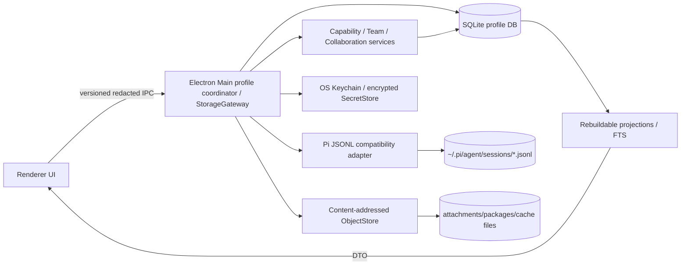
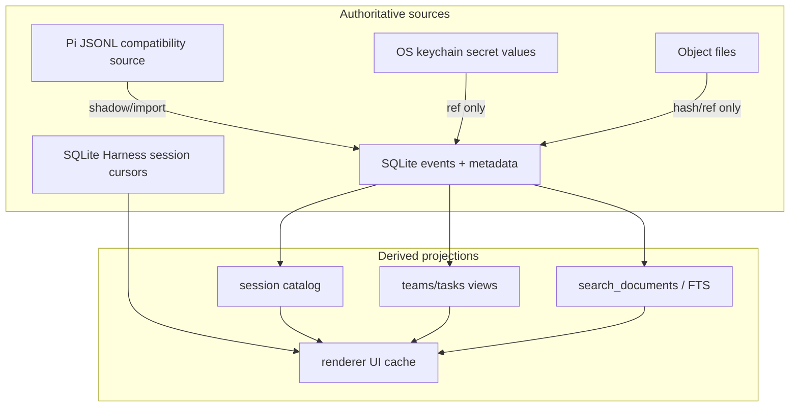
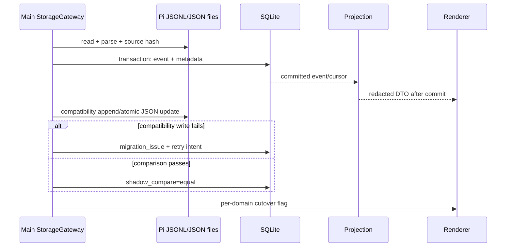
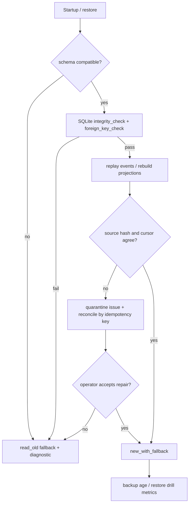
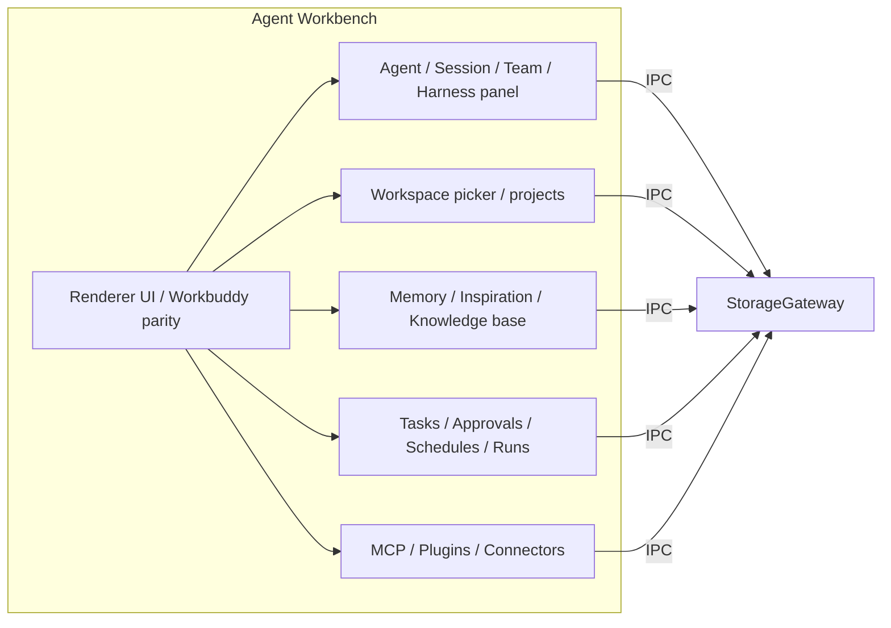
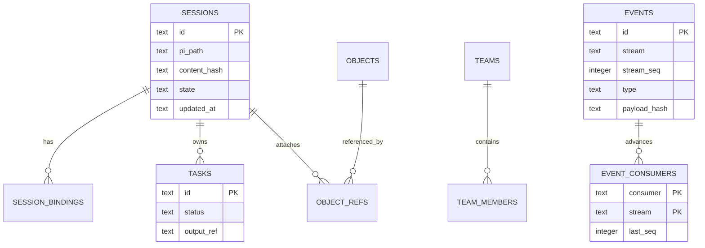
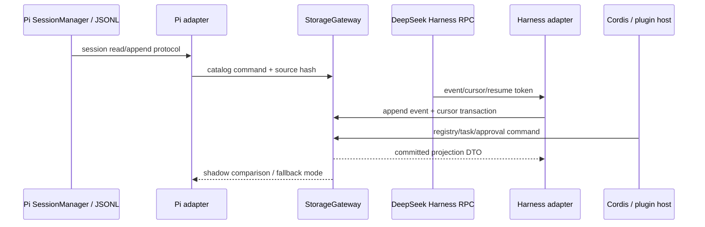
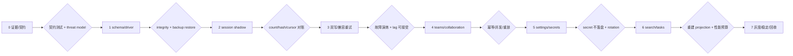
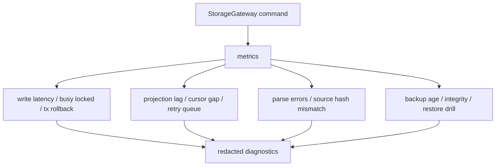

# OpenBuddy 存储架构图

## 总体架构



## 数据分层



## 迁移时序



## 恢复与回滚



## 顶层 Agent 工作台架构



目标架构中，所有需要持久化一致性的面板共享 `@openbuddy/storage` 的 Gateway；renderer 不直接读文件或数据库，只拿版本化 IPC DTO。当前 change 不新增 renderer storage IPC/DTO，既有 renderer 继续使用 localStorage 与既有 IPC。面板按域拆分而不是按后端拆分，是为了和 WorkBuddy UI 1:1 对齐的同时不破坏 Pi adapter 与 Cordis/plugin host 边界。

> 配套证据见 [`docs/storage-cross-product-survey.md`](./storage-cross-product-survey.md)（独立可读版，含 Codex/Grok-build/Pi/Pi-Heremes/OpenClaw(public)/DeepSeek-harness/WorkBuddy/OpenBuddy 八类对照，每条都带源码路径或公开 commit 引用）。本节是摘要，survey 是完整依据。

## 跨项目证据矩阵（用于决策而不是历史叙述）

| 系统 | 已核验 | 推断 | 决策依据 |
|---|---|---|---|
| Codex | `codex-rs/state/src/paths.rs` 的 6 个 runtime DB 定义、迁移/恢复代码，以及当前 `~/.codex/sqlite/codex*.db` 只读 inventory | 无 | 源码采用多 SQLite + rollout/兼容文件；当前本机数据库是新版 catalog 布局，不能用旧 `state_5.sqlite` 文件名代表当前运行态 |
| Grok-build | `xai-sqlite-journal/src/lib.rs`、`xai-grok-memory/src/schema.rs`、`storage.rs`；`rusqlite 0.37 bundled`、`JournalMode::for_db_path`、`GROK_SQLITE_JOURNAL_MODE`、`chunks`/FTS5/可选 `chunks_vec` | 完整 workspace/foreign-session schema 仍不外推 | journal policy 按文件系统选择；memory index 的 SQLite/FTS/vector 与 Markdown source 已核验 |
| Pi | `~/.pi/agent/pi-hermes-memory/sessions.db` schema：sessions / messages / memories / memory_fts(message_fts) FTS5 trigram / session_files；扩展源码使用 `better-sqlite3` | 部分 Pi 扩展用 JSONL 兼容（Pi 原生协议） | SQLite 适合 Pi 扩展的 memory/FTS/path metadata；JSONL 仍由 `SessionManager` 维护 transcript |
| WorkBuddy parity | `docs/workbuddy-parity-matrix.md`、`WORKBUDDY_UI_REFERENCE.md` | 无 | WorkBuddy 维持 JSONL/状态文件混合；OpenBuddy 收敛到 SQLite 必须在面板层 1:1 对齐，不能换 UI |
| OpenClaw 本机运行态 | 本机存在 `~/.openclaw`，但本 change 不读取内容 | runtime unknown / not-run | 不把本机凭据、transcript 或数据库状态纳入证据 | 仅对用户明确授权的脱敏副本做只读 inventory |
| OpenClaw 公开源码（commit `e5263a88d72fe689cc7db457acc1045ddb0c1555`） | `session-accessor.sqlite-transcript-store.ts`、`docs/concepts/session-search.md`、`auth-profiles/sqlite.ts`、`manager-sqlite-lease.ts` | Agent transcript/session search 使用 SQLite transcript rows + FTS projection；auth profile/memory lease 也使用 SQLite；JSONL/import 保留兼容边界 | 证明公开实现边界，不证明本机运行态数据 | 只读浅克隆与固定文件源码，不读取 `~/.openclaw` |
| Grok-build memory/workspace | `xai-grok-memory/src/schema.rs`、`storage.rs` 与 `xai-sqlite-journal` | memory index 的 `chunks`/FTS5/可选 `chunks_vec` 与 Markdown source 已由源码证明；完整 workspace DB schema 仍不外推 | 采用已核验的 memory/journal 边界；OpenBuddy 不把推断当作事实 |

## 哪些数据进 SQLite / 哪些保留原方式（最终决策）

适合进入 SQLite 的数据（按 WorkBuddy parity + Codex/pi-hermes-memory 模式）：

- **Session catalog / metadata**：title、cwd、created/updated、tokens、archived、git 上下文、WorkBuddy WorkspaceGroup 分组。对齐 Codex `threads`、`thread_dynamic_tools`、`thread_section_order`。
- **Session bindings**：pinned、archived、expert 绑定、tags、备注；通过 OpenBuddy 原 `openbuddy-state.json` 字段迁移到 `session_bindings`。
- **Event/audit journal**：`session/input`、`assistant/update`、`tool/start|end`、`agent/settled`；替换现有 `session-event-log.ts` JSONL，并提供 cursor 化的消费者。
- **Collaboration events / cursors**：替换 `collaboration-runtime.ts` 的 events/cursor JSON；cursor 与 event 事务化，resume token 由 adapter 派生。
- **Memory metadata + FTS**：`/memory`、knowledge-base、inspiration 索引；保留 Markdown 文件作为人读源，metadata/FTS 进 SQLite，对齐 pi-hermes-memory。
- **Tasks / approvals / schedules / runs / automation**：替代 capability 内部分散 JSON；保留 input/output object 仅作 ObjectStore 引用。
- **Settings/registry/versioned config**：`dsh-settings.json`、MCP/connector/package 启用状态、provider 元数据；secret refs 仅记录 keychain 引用。
- **Plugin/extension registry**：package 名、版本、enabled、sourceBaseDir、附加的 session ID；secret 不入表。
- **Search projections / FTS**：OpenBuddy SQLite 内 `search_documents` + FTS5；只索引脱敏后的 projection body。
- **Backup manifest / migration ledger**：schema_meta、app_version、backup age、object manifest。

保留原方式的数据（不进 SQLite）：

- **Pi 原始 JSONL transcript / tool message**：由 `SessionManager` 维护；OpenBuddy 仅做 catalog 投影。Codex 也保留 rollout JSONL 兼容，证明这是合理边界。
- **附件 / 插件包 / 模型缓存 / 原始导出**：content-addressed ObjectStore；SQLite 只存 hash/size/MIME。
- **API key / OAuth / cookies / session secret**：仅 secret_ref；OS Keychain/加密 provider。
- **renderer `localStorage`**：UI convenience cache，可重建，不进 system of record。
- **model cache / telemetry cache**：可重建的派生缓存不进。
- **DeepSeek Harness transport**：HTTP/WebSocket/IPC、resume token、backpressure 由 adapter 管理；只有可查询 event/cursor 投影到 SQLite。
- **WorkBuddy 状态文件读源**：在迁移完成前保留 read_old；shadow compare 通过后才切到 read_new。

## 与 Pi `pi-hermes-memory` 的协同

`pi-hermes-memory` 在 `~/.pi/agent/pi-hermes-memory/sessions.db` 已经使用 `better-sqlite3` + FTS5 trigram 索引 sessions/messages/memories/session_files，并支持 secret scanning。OpenBuddy 决定：

- 不重复实现 Pi 扩展已有能力；adapter 把 `pi-hermes-memory` 的 schema/MCP 表面投影到 `openbuddy-memory` 服务，作为 OpenBuddy 的 memory 兼容读源。
- OpenBuddy SQLite 中保存 Pi 兼容读不到的 metadata（pinned、archived、expert binding、workspace grouping、projection tags）；如该扩展不可用，回退到 `memory/*.md`。
- 工具扫描/secret 检测由 Pi 扩展负责；OpenBuddy SQLite 不存储 token。

## 与 Codex 多 DB 模型的对照

| Codex | OpenBuddy 映射 |
|---|---|
| `state_5.sqlite`（threads、thread_sections、rollout_migration_state） | `openbuddy.sqlite` 主库：`sessions`、`session_bindings`、`threads_sections`、`migration_state` |
| `thread_history_1.sqlite`（thread_items、thread_turns） | 暂不独立库；保留在主库 `thread_items` 投影，按需拆 `history.sqlite` |
| `queue_1.sqlite` | 高并发阶段拆 `queue.sqlite` |
| `logs_2.sqlite` | `logs.sqlite`（脱敏后的事件/trace） |
| `goals_1.sqlite` | 暂合并到主库；体积增长后拆 |
| `memory_migrations` | 与 `state` 合库（同 Codex 0.6+ 路线一致） |
| rollout JSONL | 保留 Pi JSONL，由 `SessionManager` 维护 |

OpenBuddy 第一阶段不拆多库，统一一个 profile 一个 `openbuddy.sqlite`，等迁移完成确认访问模式后再按 Codex 路线拆 logs/queue。协作事件 JSONL、contracts/cursor JSON、outbox 仍可位于 `openbuddy-collaboration/`，但 `CollaborationRuntime` 默认把 SQLite 指向 profile 根库；事件、contracts 和 inbox cursor 均由 package adapter 落库，文件只作兼容镜像或 transport 边界。只有显式 `databasePath` 或测试 fixture 才创建 secondary DB。历史上由 `dirname(storagePath)` 推导出的 `openbuddy-collaboration/openbuddy.sqlite` 已识别为架构漂移，不再作为生产默认。

## 与 Grok-build 的对照

| Grok-build | OpenBuddy 借鉴 |
|---|---|
| `xai-sqlite-journal` 按文件系统自动选 WAL/truncate | StorageGateway 暴露 `journalMode` 选项；本地盘默认 WAL + busy timeout；网络盘回退 truncate/rollback；记录 `journal_mode` 用于诊断 |
| `GROK_SQLITE_JOURNAL_MODE` 环境变量作为 kill-switch | OpenBuddy 暴露 `OPENBUDDY_SQLITE_JOURNAL_MODE`，并把值记录到 `schema_meta` 与 metrics |
| journal mode `effective_db_path`（per-host file） | 同 profile 多 profile 隔离：每个 profile 独立 `openbuddy.sqlite`，不要跨 profile 共享 |
| rusqlite bundled | 第一阶段使用 Node 内置 `node:sqlite`；如遇 ABI/性能瓶颈再评估 bundled `rusqlite`/`better-sqlite3` |

## 与 WorkBuddy parity 的 1:1 约束

迁移期间必须保留的 UI 行为（不能因为底层变化让 WorkBuddy 验证集退化）：

- 目标切换后 Sessions 列表仍按 `created_at/updated_at/archived/pinned` 分组；renderer 视图只读 IPC DTO，不再读文件。当前 change 不执行 renderer cutover。
- Workspace 切换必须以 atomic cursor / event 进入新工作区，旧 profile 的 journal、cache、secret 仍可读但不可写。
- Filesystem / clipboard / notification 行为不变；这些与本次存储改造正交，不在 SQLite 化范围。

## 模块边界与依赖方向

```mermaid
flowchart TB
  subgraph renderer[Renderer]
    UI[React UI]
    IPC[Versioned IPC DTO]
    UI --> IPC
  end
  subgraph main[Electron Main thin adapter]
    IPCHandler[IPC handlers]
    SessionAdapter[Pi session adapter]
    HarnessAdapter[Harness/RPC adapter]
    PluginAdapter[Plugin/Cordis adapter]
    IPCHandler --> Gateway
    SessionAdapter --> Gateway
    HarnessAdapter --> Gateway
    PluginAdapter --> Gateway
  end
  subgraph runtime[@openbuddy/storage]
    Gateway[StorageGateway contract]
    Events[EventStore + cursors]
    Projection[Projection runner]
    Migrations[Migration runner]
    Gateway --> Events
    Gateway --> Projection
    Gateway --> Migrations
  end
  subgraph providers[Provider ports]
    SQLite[SQLite driver]
    Pi[Pi JSONL adapter]
    Objects[ObjectStore]
    Secrets[SecretStore]
    Gateway --> SQLite
    Gateway --> Pi
    Gateway --> Objects
    Gateway --> Secrets
  end
  IPC -. never imports .-> SQLite
  UI -. never reads .-> Pi
  Gateway -. no dependency on .-> Electron
  Gateway -. no dependency on .-> React
```

约束：`@openbuddy/storage` 只定义 ports、事务语义和数据模型，不依赖 Electron、React、Cordis、Pi transport 或 renderer。Main 只负责生命周期、权限和 IPC DTO；Pi、DeepSeek Harness、Cordis/plugin host 通过 adapter 调用 contract，不把 SQLite API 泄漏到业务包。

静态依赖门禁：`pnpm storage:boundaries` 扫描生产源码和 storage package，禁止业务层直连 SQLite、引用 storage 内部路径或写 SQL，禁止 Renderer 访问 Node/storage，禁止 storage 反向依赖 Electron/React/capability；测试和 storage adapter 内部实现属于允许边界。当前扫描 518 个文件，0 个违规，并由 `pnpm storage:acceptance` 强制执行。Renderer Gateway 额外提供 namespace allowlist、secret-field rejection、optimistic version check、stale-write conflict 和 namespace list/remove 端口。

## 功能存储适配矩阵

| 功能 | SQLite | Pi JSONL | ObjectStore | SecretStore | 说明 |
|---|---:|---:|---:|---:|---|
| session catalog / pinned / archived / expert binding | ✅ | 兼容读 |  |  | SQLite 权威，Pi path/hash 可追溯 |
| 原始 transcript / tool message |  | ✅ 权威 | 大对象可选 |  | 保留 Pi 协议与旧版本可读性 |
| teams / tasks / workflow / approval / schedule / run | ✅ |  | 输出引用 |  | 事件 + projection，外部副作用只记 intent/status |
| collaboration / Harness event / cursor / resume | ✅ | 兼容导出 | payload 大于阈值时 |  | cursor 与 event 事务化；transport 仍独立 |
| settings / provider metadata / plugin registry | ✅ | 兼容导入 | 包文件 |  | schema/version/启用状态统一管理 |
| API keys / OAuth / cookies / session secrets | 仅 `secret_ref` |  |  | ✅ | 数据库、日志、HTML、IPC 均不放明文 |
| attachments / plugin packages / raw exports | manifest/ref |  | ✅ |  | content-addressed，SQLite 只存 hash/size/MIME |
| FTS/search metadata | ✅ FTS5 | Pi 原生查询兼容 | 原文可引用 |  | 只索引允许进入 projection 的脱敏文本 |
| renderer temporary state / cache |  |  |  |  | `localStorage` 仅 convenience cache，可丢失可重建 |

## SQLite 领域模型与一致性



每个 command 使用 `BEGIN IMMEDIATE`，在同一事务内完成幂等检查、领域行更新、event append、cursor/projection 更新；同一 driver 通过 writer queue 串行化，跨 capability adapter 通过 SQLite file lock + `busy_timeout` 协调；commit 成功后才发 IPC notification。网络请求、模型调用、文件写入等外部副作用不伪装成 SQLite 原子事务，改用 durable intent、attempt、result event。长事务和多进程灰度阶段再启用 shared profile connection / fenced writer lease。

## Pi、DeepSeek Harness 与插件接入



Pi JSONL 是 transcript compatibility source，不被 SQLite schema 取代；Harness 的 HTTP/WebSocket/IPC transport、resume token 和 backpressure 由 adapter 管理，SQLite 只保存可查询的 event envelope、cursor、attempt 状态和安全引用。

## 迁移门禁与开放计划

当前生产接入状态：`@openbuddy/storage` 已被 `@openbuddy/core-session`、Electron session event façade、`CollaborationRuntime`、DeepSeek workspace registry、subagent capability、calendar、team、task、automation、notification、approval、MCP、email、memory capability 和 settings/credentials adapters 使用。SQLite 是结构化 metadata/projection 的新读写主路径；Pi JSONL/transcript、Plan custom entry、Markdown memory、Pi `todo/write`、旧 JSON/JSONL、Harness RPC cache、resume token、relay outbox、subprocess spill 仍由 adapter 维护，Harness session cursor 已进入 schema v5，协作 contracts/inbox cursor 已进入 schema v6，email state 已进入 schema v7，workspace catalog 已进入 schema v8，calendar event state 已进入 schema v9，task snapshot compatibility marker 已进入 schema v10；renderer 继续使用既有 localStorage 和既有版本化 IPC DTO，`RendererStorageGateway` 仅保留为 package 内未来 seam，本 change 不新增 renderer storage IPC。隔离 fixture 迁移/恢复演练与 `pnpm storage:drill` 发布门禁已完成；迁移问题通过 `MigrationIssueStore` 写入 `migration_issues`，由 `DurableOperationStore` 编排重试。本轮继续推进 Renderer Workspace 域正式 IPC cutover：新增 `storage:workspace-bootstrap`（返回脱敏 `openbuddy.storage-workspace-bootstrap.v1` DTO）与 `storage:metrics-history`（`StorageMetricsRegistry` 32 长度环形缓冲 + `recentStorageMetrics` 暴露），driver `healthSnapshot` 自动 `recordSnapshot`。前轮 Renderer Session 域正式 IPC cutover（read/list/write-versioned/remove + storage:metrics，namespace/key allowlist、secret-field rejection、optimistic version conflict；旧 sessions/list 与 localStorage 保留为 fallback）与 driver 脱敏 metrics（writes/busy/rollbacks/totalLatencyMs/maxLatencyMs/lastWriteAt/lastBackupAt/migrationIssues）。下一批门禁为 Keychain rotation、真实用户 fixture 灰度、指标观测和旧派生路径回收；迁移入口已新增 `pnpm storage:preflight`（基于 `LegacySourcePreflight`）作为只读 shadow-import gate，输出 `openbuddy.storage-legacy-preflight.v1` 报告，不写库、不改源、不返回正文。



| 阶段 | 交付物 | Exit gate | 回滚 |
|---|---|---|---|
| P0 | 证据矩阵、contract、数据分类、威胁模型 | 未知项显式标记；无 secret 进入样例 | 不改用户数据 |
| P1 | 独立 package、SQLite driver、migration/backup | integrity/FK、半写入恢复、重复执行通过 | 旧文件只读 |
| P2 | session catalog shadow projection | count、source hash、cursor 对账 | `read_old` |
| P3 | 双写与 durable retry issue | 兼容写失败可重试且不丢 event | `new_with_fallback` |
| P4–P6 | teams、Harness、settings、memory/task/automation/notification | 每域独立 feature flag 和重建命令 | 按域切回旧读 |
| P7–P8 | email、DeepSeek workspace、subagent、Harness event projection | legacy import/mirror、重启恢复、catalog 对账 | 按域切回旧读 |
| P9 | 灰度、restore drill、旧路径回收 | 一个发布周期稳定且备份可恢复 | 恢复快照并禁用 cutover |

## 生产观测与恢复指标



告警只携带 schema version、domain、event type、hash 前缀、计数和错误分类，不携带路径、prompt、transcript、token、cookie 或 secret。`StorageHealthSnapshot` 提供 journal/synchronous、FK、busy timeout、schema/event 计数、queue depth 和 integrity/FK 的只读脱敏诊断；catalog 多语句写入统一经过 driver queue/transaction，同步写入遇到异步队列时 fail-closed；恢复流程必须可脚本化：一致性备份 → `integrity_check`/FK check → replay/rebuild projection → hash 抽样 → 业务 smoke test → 记录 restore drill。
## Workbuddy 体验 vs SQLite 化

Workbuddy parity 矩阵显示当前 UI 直接消费 Pi `AgentSession`、JSON 状态文件、`localStorage`。目标架构中，SQLite 化的关键不是替换 UI，而是把未来需要持久化一致性的工作台状态操作改写为"versioned IPC DTO + StorageGateway"；本 change 不新增 renderer IPC/DTO，仍保留现有 localStorage 边界：

1. 后续获批的 renderer 接入中，Sessions/Workspace/Knowledge/Automation 面板才读 `read_new` IPC DTO，离线时回到 `read_old` JSON；当前 change 不执行这一步。
2. 跨面板的事务性（"pin + 改 workspace 分组 + 留笔记"）用同一 StorageCommand + idempotency key 提交，commit 后才广播。
3. Workbuddy 的 filesystem/clipboard/notification 仍走现有 facade；本 change 不重写它们。
4. 验证集优先保留：renderer reload、Electron restart、跨 profile 切换、append/import、pinned/archive。

## 7. SQLite 实施顺序（按 OpenBuddy + Codex 路线）

1. **P0 Storage contract 与 driver**：已经在 `packages/runtime/openbuddy-storage` 完成；包含 redact envelope、WAL/rollback、参数化语句、显式 transaction、integrity/FK check、`StorageHealthSnapshot` 脱敏诊断、`VACUUM INTO` 备份、`restoreStorageBackup` 临时路径校验与原子发布、EventStore append/replay/rebuild、MigrationRunner forward/idempotent/half-write recovery 与统一 `openStorage`。
2. **P1 Schema 版本与领域基础表**：统一一个 profile 一个 `openbuddy.sqlite`；已实现 v10 `schema_meta`、`events`、`event_consumers`、`idempotency_results`、`workspaces`、`workspace_catalog`、`workspace_archived_sessions`、`calendar_events`、`calendar_state_meta`、`session_task_snapshots`、`sessions`、`session_bindings`、settings/plugin/task/approval/schedule/run、memory/FTS、object/secret refs、migration issue/backup manifest；保留 Codex 的 `runtime_migrator`/`migrations_tests` 路线。
3. **P2 Session catalog shadow**：已实现 Pi JSONL metadata importer，从 `~/.pi/agent/sessions/*.jsonl` + `openbuddy-state.json` 只读扫描，记录 source hash/count/parse errors，写入 `sessions` projection；canonical session service 和 Electron facade 在 setter 前确保目标 session 已导入，SQLite metadata 为权威，旧 JSON 仅镜像/迁移源。
4. **P3 双写兼容 adapter**：`LegacyFilesAdapter` 已覆盖 settings、session event JSONL、Markdown memory、team registry 的 shadow import；session/team/collaboration/task/automation/notification/memory/approval 已有 SQLite-first adapter，旧 JSON/JSONL 继续镜像或 fallback；失败显式返回，由调用方写入 `migration_issues` 并用 `DurableOperationStore` 重试，不静默吞错。
5. **P4 Memory / Knowledge / Inspiration**：`MemoryIndex` 已提供 metadata + FTS projection；当前 capability 写入后同步索引，后续把 Markdown 目录扫描改为增量 hash/import，保留 Markdown 文件作为人读源。
6. **P5 Settings / Registry / Secrets**：versioned settings rows + `secret_refs`；MCP 非敏感 registry 已通过 `McpRegistry` 投影到 SQLite，并递归过滤 secret fields/query credentials；`CredentialStore` 将 credentials 从 `dsh-credentials.json` 迁出，生产明文只写入由 `createPlatformSecretStore` 选择的 Keychain/显式加密 provider，测试使用 ephemeral provider，legacy import 使用 pending/complete 两阶段标记；旧 JSON 只读兼容，provider 不可用时新增/修改/删除 fail-closed。
7. **P6 Tasks / Automations / Notifications / Approvals / MCP**：对应 catalogs 已替代 capability 的 SQLite 主读写；旧 JSON 仍镜像/fallback，`.pi/mcp.json` 仍保留为 Pi 兼容源。
8. **P7 DeepSeek Harness event/cursor 投影**：当前 cursor/contract 已进入 SQLite；HTTP/WebSocket/IPC event 的进一步投影仍由 adapter 按事件大小和敏感性灰度接入，resume token 由 adapter 派生。
9. **P8 DeepSeek workspace / subagent state**：workspace catalog 与 subagent config 已通过 package adapters 接入；Plan custom entry、Harness RPC cache 与 subprocess spill 保持各自协议/缓存边界。
10. **P9 灰度发布 / restore drill**：按域切回 `read_old` 的能力、secret rotation、备份恢复演练；至少一个发布周期保留旧路径。

每阶段的 exit gate：见上一节"迁移门禁"表。

## 8. 决策回顾

- **第一阶段驱动**：`node:sqlite`（Electron 自带 Node），封装在 `@openbuddy/storage`；不暴露 `DatabaseSync`；性能/ABI 出现瓶颈再评估 `better-sqlite3`。
- **Schema 管理**：`MigrationRunner` + 顺序 forward migration + `schema_meta` 记录 status/previous/detail，与 Codex `runtime_migrator` 思路一致；不引入 SQLx 风格的运行时检测，仅在启动做 schema version + WAL recovery + 轻量 integrity check。
- **事件/审计**：`events` append-only + `event_consumers` cursor；与 Codex `thread_event` 的 cursor 模型一致。
- **多库策略**：单 profile 单库为主；按访问压力在 P6 之后评估 logs/queue 拆分。
- **Secret**：`secret_refs` + OS Keychain/加密 provider；不写入数据库、HTML、日志、IPC。
- **Workbuddy 1:1 parity**：所有 UI DTO 必须用 `versioned IPC`；renderer 不读文件。

## 9. 与 DeepSeek Harness / Cordis plugin host 的契约

- Cordis/plugin host 仅调用 StorageGateway 的 command 表面，不感知 SQLite/Pi/Harness 的差异。
- DeepSeek Harness RPC event 进入 StorageGateway 的 `events` 表；Harness adapter 负责 resume token、backpressure 与 transport 重试；SQLite 只存可查询的事件与 cursor。
- Pi adapter 调用 SessionManager 读取/写入 JSONL，并行调用 StorageGateway 更新 catalog；失败时以 session hash 决定是否回填。

## 10. OpenClaw 公开源码补充证据

本机 `~/.openclaw` 运行态仍保持 `unknown / not-run`，没有读取用户数据库、transcript、凭据或 prompt。对公开仓库 commit `e5263a88d72fe689cc7db457acc1045ddb0c1555` 的只读源码核验显示：Agent transcript 写入 SQLite `transcript_events`，session search 使用同一 Agent SQLite 数据库的全文索引；auth profile 与 memory coordination lease 也使用 SQLite。公开源码同时保留 JSONL/import 与兼容层，因此该系统同样采用“SQLite 结构化主路径 + 文件协议/导入边界”，但公开源码证据不等于本机运行态证据。

## 11. 已知限制

- OpenClaw 本机运行态保持 unknown/not-run；公开源码边界已在上一节单独记录，不把公开源码推断为本机运行态事实。
- Grok-build 的 journal policy 与 `xai-grok-memory` index schema 在本机源码可核验；完整 workspace/foreign-session 运行时仍标记 unknown。
- Node `node:sqlite` 仍在 Vite/Vitest resolver 中可能需要 runtime factory；继续保留 Moon 的 `vitest run --config` 定向测试作为单一可信源。
- 不会修改主工作区未提交用户改动；不会触碰 `electron/main/index.ts`、IPC 通道、renderer 代码（除非后续 change 显式批准）。

## 模块边界与依赖方向
